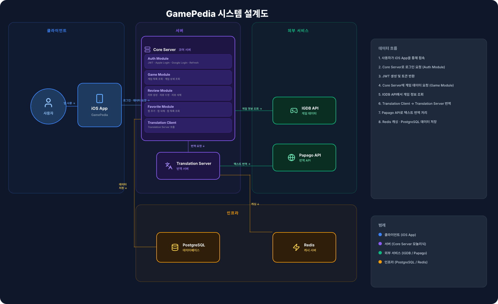

# GamePediaDocs

GamePedia 전체 시스템을 설명하기 위한 문서 전용 저장소입니다.  
이 저장소는 애플리케이션 소스 코드를 포함하지 않으며, iOS 앱, 서버, 인프라, 디자인, 품질 기준을 구조적으로 정리하는 것을 목표로 합니다.

## 프로젝트 개요

GamePedia는 게임 탐색, 게임 상세 조회, 리뷰 작성, 찜 관리 기능을 제공하는 iOS 애플리케이션입니다.

최신 시스템 구조는 다음 원칙을 기준으로 정리되어 있습니다.

- 클라이언트는 `UIKit + Combine + MVI + Coordinator` 기반의 iOS App으로 구성됩니다.
- 메인 서버는 `Core Server`이며, 인증은 별도 서버가 아니라 `Core Server` 내부 `Auth Module`에서 처리됩니다.
- 번역은 별도 `Translation Server`가 담당하며, `Papago API`와 `Redis` 캐시를 사용합니다.
- 도메인 데이터는 `PostgreSQL`에 저장됩니다.

## 시스템 구조 요약

| 구성 요소 | 설명 |
| --- | --- |
| iOS App | 사용자 인터페이스, 상태 관리, API 호출 |
| Core Server | 인증, 게임, 리뷰, 찜 기능을 제공하는 메인 서버 |
| Auth Module | JWT 발급, Apple Login, Google Login, Refresh Token |
| Game Module | 게임 목록 조회, 게임 상세 조회 |
| Review Module | 리뷰 생성, 수정, 삭제 |
| Favorite Module | 찜 추가, 삭제, 목록 조회 |
| Translation Client | Translation Server 호출 |
| Translation Server | Papago API 호출, Redis 캐싱 |
| PostgreSQL | 사용자/리뷰/찜/도메인 데이터 저장 |
| Redis | 번역 캐시 저장 |
| IGDB API | 외부 게임 정보 제공 |
| Papago API | 외부 번역 제공 |

## 아키텍처 다이어그램



## 문서 구조 안내

```text
docs/
├── 00-overview
├── 01-architecture
├── 02-design
├── 03-client-ios
├── 04-server
├── 05-infra
└── 06-quality
```

문서는 개요에서 세부 구조로 내려가는 방식으로 읽는 것을 권장합니다.

1. `00-overview`
2. `01-architecture`
3. `03-client-ios` / `04-server`
4. `05-infra`
5. `06-quality`
6. `02-design`

## 각 문서 설명

### 00-overview

- 경로: [docs/00-overview/project-overview.md](docs/00-overview/project-overview.md)
- 목적: 프로젝트 소개, 기술 스택, 전체 구조 요약을 가장 먼저 이해하기 위한 문서

### 01-architecture

- 경로: [docs/01-architecture/system-architecture.md](docs/01-architecture/system-architecture.md)
- 목적: 최신 시스템 아키텍처, Core Server 내부 모듈 구조, 데이터 흐름, 전체 다이어그램 설명

### 02-design

- 경로: [docs/02-design/ui-structure.md](docs/02-design/ui-structure.md)
- 목적: Home, Search, Game Detail, Review, Profile 화면 구조와 디자인 시스템 방향 정리

### 03-client-ios

- 경로: [docs/03-client-ios/ios-architecture.md](docs/03-client-ios/ios-architecture.md)
- 목적: MVI 구조, Coordinator 패턴, iOS 데이터 흐름, 계층 분리 설명

### 04-server

- 경로: [docs/04-server/server-architecture.md](docs/04-server/server-architecture.md)
- 목적: Core Server 계층 구조, Auth/Game/Review/Favorite Module, Translation Server, Redis 전략 설명

### 05-infra

- 경로: [docs/05-infra/environment-structure.md](docs/05-infra/environment-structure.md)
- 목적: dev / staging / production 환경 분리, `.env`, `Secrets.xcconfig`, 보안 전략 설명

### 06-quality

- 경로: [docs/06-quality/logging-monitoring.md](docs/06-quality/logging-monitoring.md)
- 목적: Winston 로그 전략, 로그 레벨, 모니터링, 에러 추적 전략 설명

## 유지 원칙

- 문서는 항상 최신 아키텍처를 기준으로 갱신합니다.
- 다이어그램과 문서 표현은 서로 같은 구조를 가리켜야 합니다.
- 인증은 `Core Server` 내부 `Auth Module` 기준으로 설명합니다.
- 번역 흐름은 `Core Server -> Translation Server -> Papago API -> Redis` 기준으로 설명합니다.
