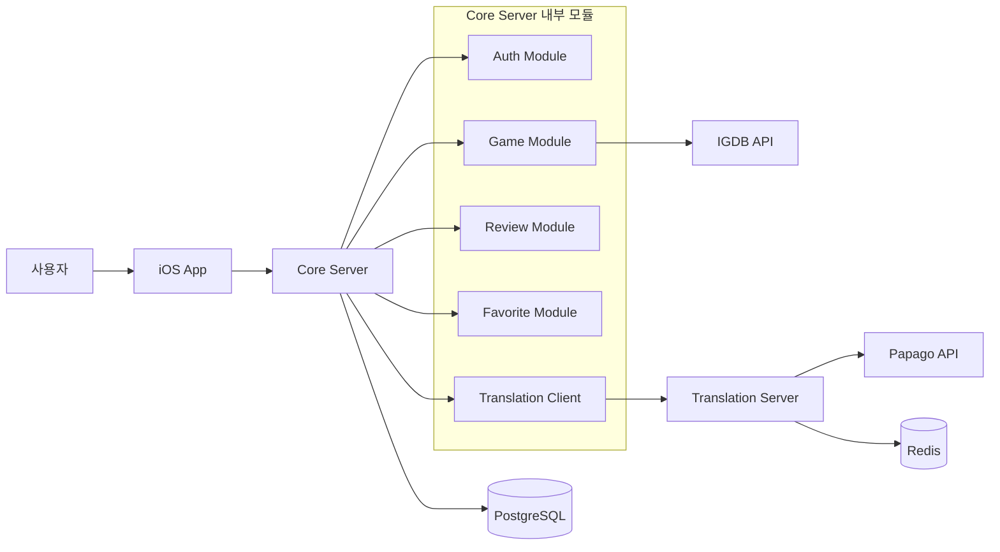

# GamePedia 프로젝트 개요

## 문서 목적

이 문서는 GamePedia의 최신 시스템 구조를 가장 빠르게 이해하기 위한 개요 문서다. iOS 앱, Core Server (코어 서버), Translation Server (번역 서버), 데이터 저장소, 외부 API의 관계를 한눈에 정리한다.

## 프로젝트 소개

GamePedia는 게임 정보를 탐색하고, 상세 정보를 확인하고, 리뷰를 작성하며, 찜 목록을 관리할 수 있는 iOS 애플리케이션이다.  
클라이언트는 `UIKit + Combine + MVI + Coordinator` 패턴으로 구성되며, 서버는 `Core Server` 중심 구조를 사용한다.

최신 아키텍처의 핵심은 다음과 같다.

- 인증은 `Core Server` 내부 `Auth Module`에서 처리한다.
- 게임 정보는 `Core Server`가 `IGDB API`와 통신해 조회한다.
- 번역은 `Core Server`가 별도 `Translation Server`를 호출해 처리한다.
- 번역 결과는 `Translation Server`에서 `Redis`에 캐싱한다.
- 영속 데이터는 `PostgreSQL`에 저장한다.

## GamePedia 앱 목적

GamePedia의 목적은 다음 세 가지를 안정적으로 제공하는 것이다.

- 게임 탐색과 상세 정보 조회
- 리뷰 작성, 수정, 삭제
- 찜(Favorite) 관리와 개인화 경험

## 기술 스택 정리

### iOS

| 항목 | 기술 |
| --- | --- |
| UI | UIKit |
| 비동기 / 이벤트 | Combine |
| 상태 관리 | MVI |
| 화면 전환 | Coordinator |
| 앱 아키텍처 | UseCase (유즈케이스), Repository (레포지토리), DataSource (데이터소스) |

### Server

| 항목 | 기술 |
| --- | --- |
| Runtime | Node.js |
| Web Framework | Express |
| ORM | Prisma |
| 인증 | JWT |
| 캐시 | Redis |
| 로깅 | Winston |
| 데이터베이스 | PostgreSQL |

## 프로젝트 구조 설명

```text
GamePedia/
├── apps/
│   └── ios
├── servers/
│   ├── core
│   └── translation
├── docs/
│   ├── 00-overview
│   ├── 01-architecture
│   ├── 02-design
│   ├── 03-client-ios
│   ├── 04-server
│   ├── 05-infra
│   └── 06-quality
└── README.md
```

| 경로 | 설명 |
| --- | --- |
| `apps/ios` | iOS App (UIKit + Combine + MVI + Coordinator) 구현 영역 |
| `servers/core` | 인증, 게임, 리뷰, 찜 기능을 포함한 메인 API 서버 |
| `servers/translation` | Papago API 연동과 Redis 캐싱을 담당하는 번역 서버 |
| `docs` | 시스템 구조, 설계도, 운영 기준을 정리하는 문서 영역 |

## 최신 시스템 구성 요약

| 구성 요소 | 역할 |
| --- | --- |
| iOS App | 사용자 입력, 화면 렌더링, 상태 관리, API 호출 |
| Core Server | 인증, 게임, 리뷰, 찜 도메인 처리의 중심 서버 |
| Auth Module | JWT 발급, Apple Login, Google Login, Refresh Token 처리 |
| Game Module | 게임 목록 조회, 게임 상세 조회 |
| Review Module | 리뷰 생성, 수정, 삭제 |
| Favorite Module | 찜 추가, 삭제, 목록 조회 |
| Translation Client | Translation Server 호출 |
| Translation Server | Papago API 호출, Redis 캐싱 |
| PostgreSQL | 사용자/리뷰/찜/도메인 데이터 저장 |
| Redis | 번역 결과 캐싱 |

## 전체 데이터 흐름 다이어그램



## 레이어 구조 설명

| 레이어 | 구성 요소 | 설명 |
| --- | --- | --- |
| Client Layer | View, Intent, State, Reducer, ViewModel, Coordinator | 사용자 입력 처리와 화면 상태 렌더링 |
| Domain Layer | UseCase, Core Modules | 기능 단위 비즈니스 로직 실행 |
| Data Layer | Repository, DataSource, Prisma, Translation Client | 데이터 조회/저장과 외부 통신 추상화 |
| Storage Layer | PostgreSQL, Redis | 영속 데이터 및 캐시 저장 |
| External Integration Layer | IGDB API, Papago API, Apple Login, Google Login | 외부 서비스 연동 |

## 책임 분리 설명

| 영역 | 주요 책임 | 분리 이유 |
| --- | --- | --- |
| iOS App | UI, 상태 관리, 사용자 액션 처리, 토큰 저장 | 클라이언트 경험과 서버 책임을 분리하기 위해 |
| Core Server | 인증, 게임, 리뷰, 찜 기능의 통합 API 제공 | 핵심 도메인 로직을 한 서버에서 일관되게 관리하기 위해 |
| Translation Server | 번역 처리, Papago 호출, Redis 캐시 | 번역 성능과 비용 제어를 Core와 분리하기 위해 |
| PostgreSQL | 영속 데이터 저장 | 트랜잭션과 정합성이 필요한 데이터를 안정적으로 관리하기 위해 |
| Redis | 번역 캐시 | 반복 번역 요청의 응답 속도를 높이고 외부 API 비용을 줄이기 위해 |

## 확장성 고려 사항

- `Core Server` 내부를 모듈 단위로 나누어 기능 확장 시 영향 범위를 줄인다.
- `Translation Server`를 별도 서버로 유지해 번역 부하를 독립적으로 확장할 수 있다.
- `Redis` 캐시를 통해 Papago API 호출량과 지연 시간을 줄일 수 있다.
- `PostgreSQL + Prisma` 조합으로 도메인 데이터 접근 규칙을 일관되게 유지할 수 있다.
- `MVI + Coordinator` 기반 iOS 구조로 화면과 상태 흐름의 복잡도를 제어할 수 있다.

## 관련 문서

- [시스템 아키텍처](../01-architecture/system-architecture.md)
- [UI 구조](../02-design/ui-structure.md)
- [iOS 아키텍처](../03-client-ios/ios-architecture.md)
- [서버 아키텍처](../04-server/server-architecture.md)
- [환경 구조](../05-infra/environment-structure.md)
- [로깅 및 모니터링](../06-quality/logging-monitoring.md)
