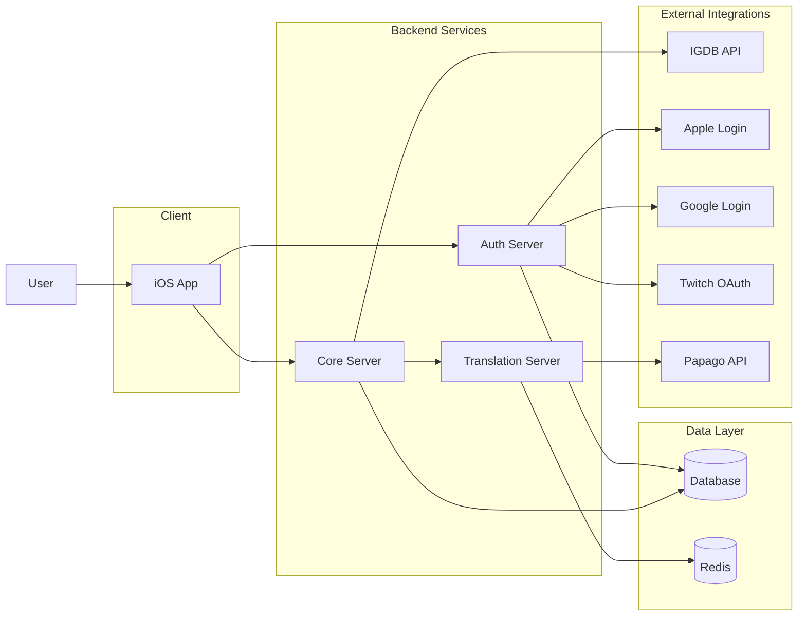

# GamePedia 프로젝트 개요

## 문서 목적

이 문서는 GamePedia 전체 구조를 가장 빠르게 이해하기 위한 출발점이다. iOS 클라이언트, 서버, 인프라, 디자인 문서를 읽기 전에 시스템의 역할 분리와 데이터 흐름을 한 번에 파악할 수 있도록 정리한다.

## 프로젝트 개요

GamePedia는 게임 탐색, 상세 정보 조회, 리뷰 작성과 관리를 지원하는 iOS 애플리케이션이다. 클라이언트는 `UIKit + Combine + MVI + Coordinator` 구조를 사용하고, 서버는 `Core / Auth / Translation`으로 역할을 분리한 멀티 서비스 구조를 사용한다.

핵심 흐름은 다음과 같다.

- 사용자는 iOS 앱에서 게임을 탐색한다.
- 인증이 필요한 기능은 Auth Server를 통해 로그인하고 JWT를 발급받는다.
- 게임 데이터, 리뷰, 사용자 데이터는 Core Server가 제공한다.
- 번역이 필요한 콘텐츠는 Translation Server가 Papago와 Redis 캐시를 활용해 처리한다.

## 기술 스택 정리

| 영역 | 기술 |
| --- | --- |
| iOS Client | UIKit, Combine, MVI, Coordinator, UseCase, Repository |
| Core Server | Node.js, Express, Prisma |
| Auth Server | Node.js, Express, JWT, OAuth |
| Translation Server | Node.js, Papago API, Redis |
| Data | Database, Redis |
| Quality | Winston logger |
| Design / Docs | Pencil, Figma, FigJam, Markdown |

## 디렉터리 구조 설명

상위 디렉터리는 다음 기준으로 이해한다.

```text
GamePedia/
├── apps/
│   └── ios
├── servers/
│   ├── core
│   ├── auth
│   └── translation
├── docs/
│   ├── 00-overview
│   ├── 01-architecture
│   ├── 02-design
│   ├── 03-client-ios
│   ├── 04-server
│   ├── 05-infra
│   └── 06-quality
└── README.md
```

| 경로 | 역할 |
| --- | --- |
| `apps/ios` | UIKit 기반 iOS 클라이언트와 화면 흐름, 상태 관리, 네트워크 연동을 담당한다. |
| `servers/core` | 게임 데이터, 리뷰, 사용자 관련 도메인 API를 제공한다. |
| `servers/auth` | JWT 발급, OAuth 로그인, 인증 관련 보안 경계를 담당한다. |
| `servers/translation` | 번역 요청 처리, Papago 연동, Redis 캐시를 담당한다. |
| `docs` | 전체 구조, 설계도, 품질 기준, 환경 정의를 문서화한다. |

## 전체 시스템 데이터 흐름 다이어그램



이 다이어그램은 사용자 요청이 어떤 서비스 경계를 지나가는지 보여준다. 인증은 Auth Server, 도메인 데이터는 Core Server, 번역은 Translation Server가 맡고, 데이터 저장과 캐싱은 Database와 Redis가 담당한다.

## 레이어 구조 설명

| 레이어 | 구성 요소 | 설명 |
| --- | --- | --- |
| Presentation | UIKit View, ViewController, Coordinator | 사용자 입력, 화면 구성, 화면 전환을 담당한다. |
| Application | MVI Store, Intent, Reducer, UseCase | 상태 변경, 유스케이스 실행, 기능 흐름 제어를 담당한다. |
| Data Access | Repository, Network, Cache | 원격 API와 로컬 캐시 접근을 추상화한다. |
| Backend API | Core / Auth / Translation | 클라이언트 요청을 처리하고 외부 API 및 저장소와 통신한다. |
| Infrastructure | Database, Redis, Environment config | 영속 데이터, 캐싱, 배포 환경 분리를 담당한다. |

## 책임 분리 설명

| 구성 요소 | 주요 책임 | 분리 이유 |
| --- | --- | --- |
| iOS App | UI, 사용자 입력, 상태 렌더링, 토큰 저장 | 프론트엔드 로직과 서버 로직을 분리하기 위해 |
| Auth Server | 로그인, 토큰 발급/검증, OAuth 연동 | 인증 경계를 독립시키기 위해 |
| Core Server | 게임, 리뷰, 사용자 도메인 API | 핵심 비즈니스 로직을 집중시키기 위해 |
| Translation Server | 번역 처리, 캐시 활용 | 비용과 지연이 큰 번역 기능을 분리하기 위해 |
| Database | 사용자/리뷰/게임 관련 영속 저장 | 정합성과 조회 책임을 분리하기 위해 |
| Redis | 번역 캐시, 빠른 응답 보조 | 반복 번역 비용을 줄이기 위해 |

## 확장성 고려 사항

- 클라이언트는 `Coordinator + MVI + UseCase + Repository`로 기능 추가 시 영향 범위를 좁힌다.
- Auth, Core, Translation을 서비스로 분리해 트래픽 특성에 맞게 개별 확장이 가능하다.
- Translation Server는 Redis 캐시를 통해 외부 번역 API 호출량을 줄일 수 있다.
- 환경을 `dev / staging / production`으로 분리해 배포 리스크를 낮춘다.
- 문서는 `overview / architecture / design / client / server / infra / quality`로 나눠 관리해 팀 확장 시 유지보수성을 높인다.

## Pencil / Figma / FigJam용 보드 구성

### 배치 순서

1. 사용자와 제품 흐름
2. iOS 클라이언트 구조
3. 서버 구조
4. 외부 서비스
5. 환경 분리
6. 품질 및 로깅 포인트

### 박스 구성

- 사용자
- iOS App
- Auth Server
- Core Server
- Translation Server
- Database
- Redis
- IGDB / OAuth Provider / Papago

### 그룹 방식

- 클라이언트, 서버, 외부 연동, 인프라를 색상별 영역으로 구분한다.
- Storage는 서버 하단에 배치해 종속 방향이 한눈에 보이게 한다.

### 화살표 규칙

- 실선: 주요 요청 흐름
- 점선: 보조/검증/캐시 흐름
- 굵은 화살표: 로그인 또는 핵심 사용자 여정

### 시각적 강조 포인트

- Auth와 Core의 책임 경계
- Translation과 Redis의 캐시 관계
- 외부 API가 내부 시스템 밖에 있다는 점

## 관련 문서

- [시스템 아키텍처](../01-architecture/system-architecture.md)
- [iOS 아키텍처](../03-client-ios/ios-architecture.md)
- [서버 아키텍처](../04-server/server-architecture.md)
- [환경 구조](../05-infra/environment-structure.md)
- [로깅/모니터링](../06-quality/logging-monitoring.md)
