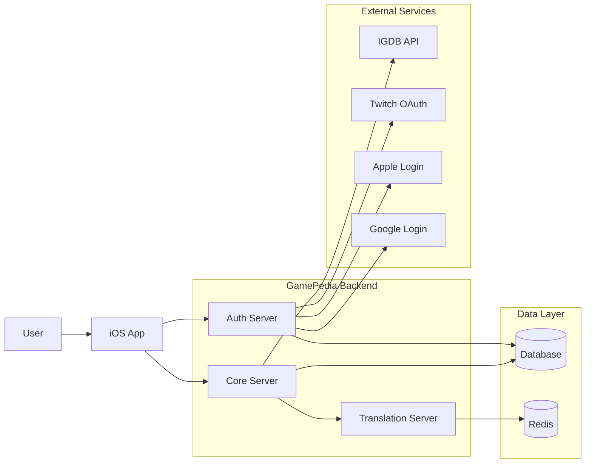
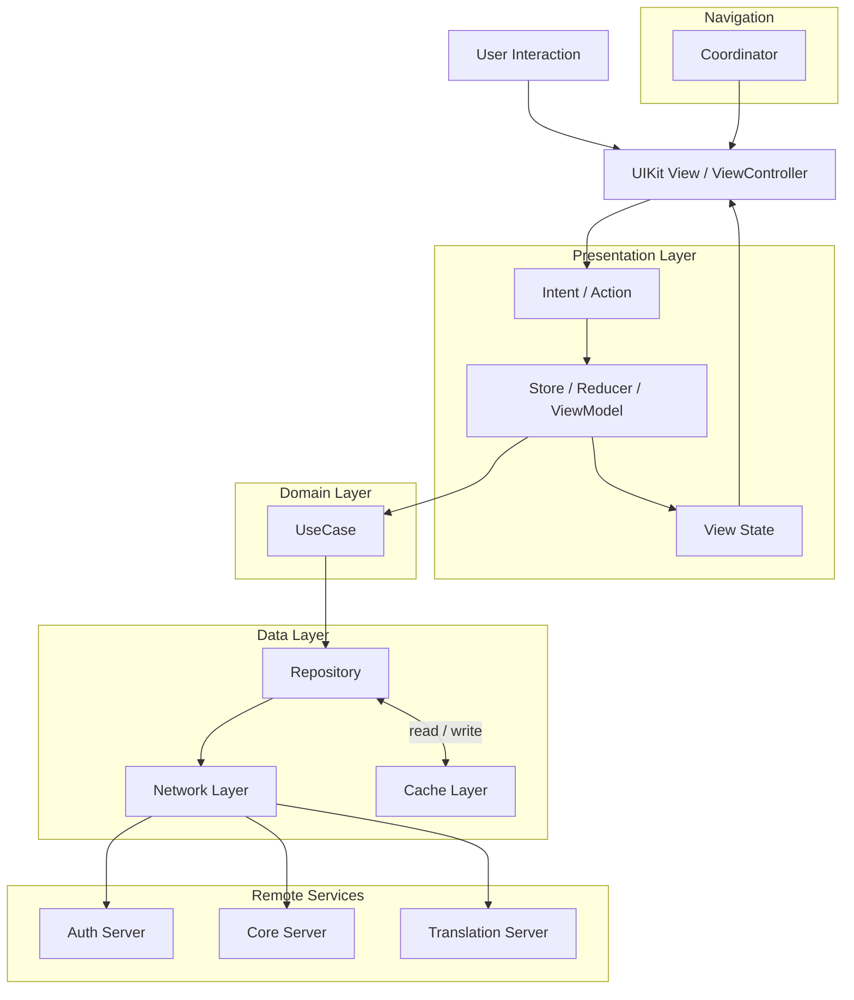
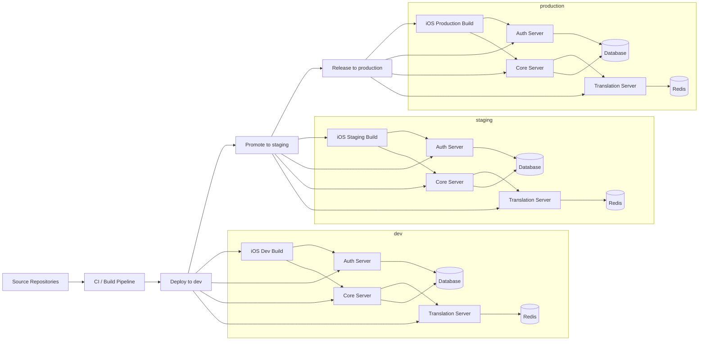
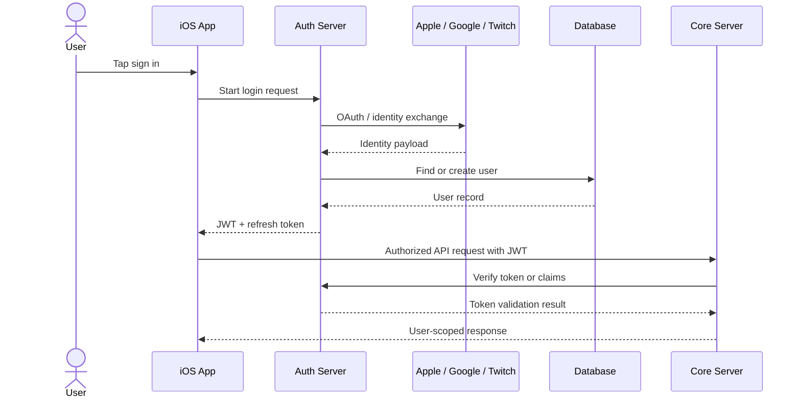

# System Diagrams

Starter diagrams for architecture communication. These are intentionally lightweight drafts that can be refined later in Figma, FigJam, or Pencil.

## Overall System Architecture

This view is the fastest way to explain the system boundary. The iOS app talks to the Auth Server for identity, the Core Server for domain features, and the Core Server can depend on the Translation Server and external providers as needed.

## iOS Client Architecture

This diagram shows the client as layered and unidirectional. Coordinators own navigation, MVI handles state flow, UseCases hold app-specific business logic, and Repositories hide the details of remote and cached data access.

## Environment Separation

This draft makes the environment boundary explicit. Each environment has its own app build and backend stack, while promotion flows move in one direction from dev to staging to production.

## Authentication Flow

This flow explains the separation between authentication and application data. The Auth Server owns login and token issuance, while the Core Server trusts verified identity to serve user-specific features.
