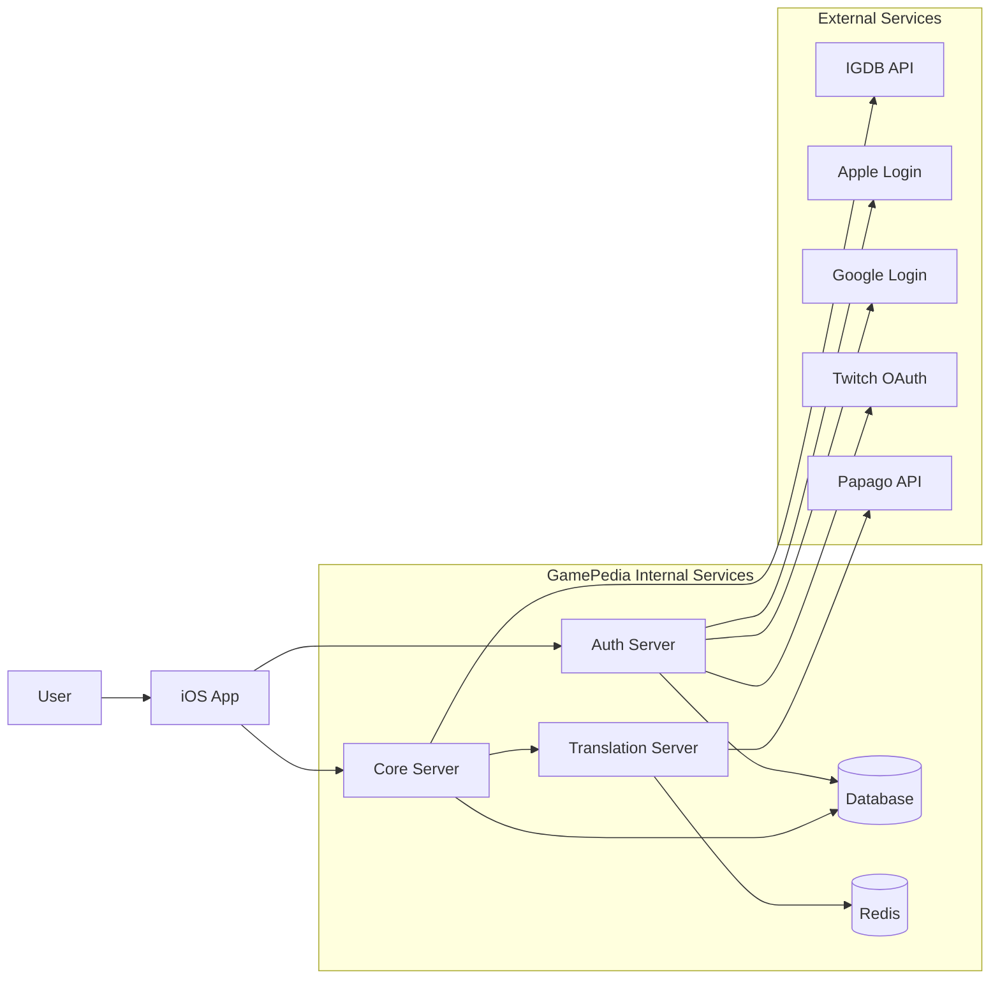
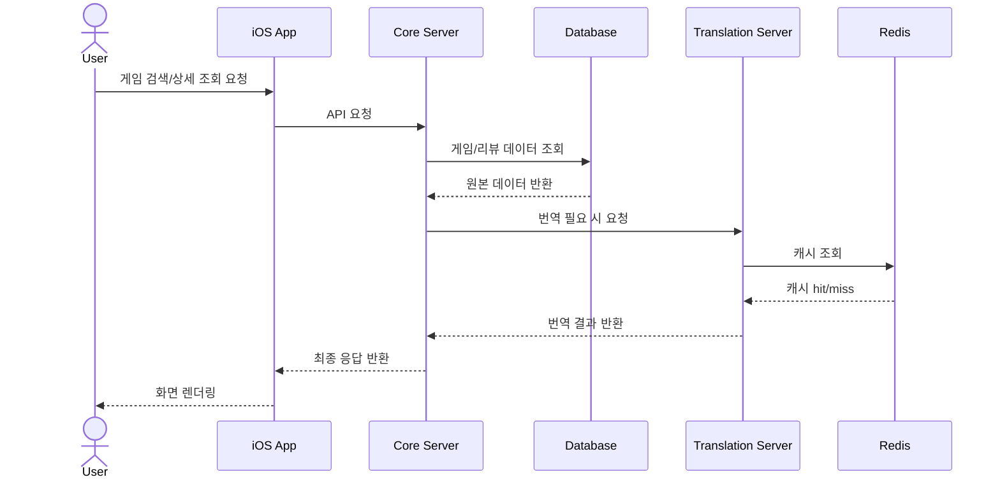
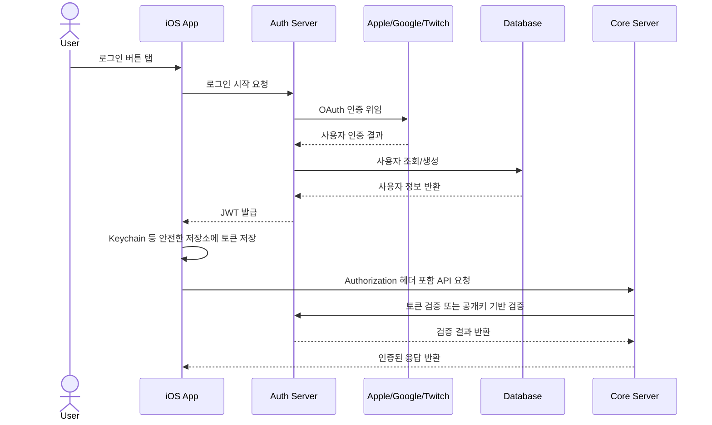
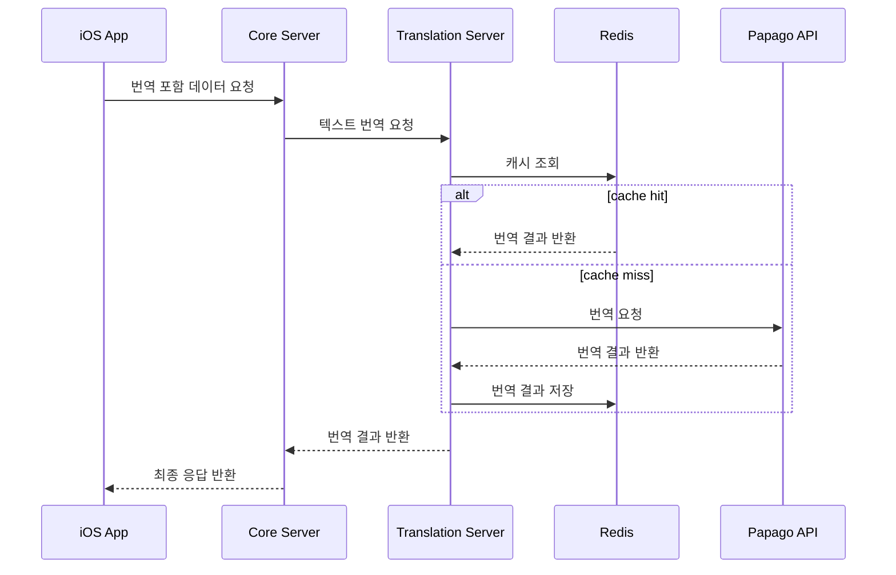

# GamePedia 시스템 아키텍처

## 문서 목적

이 문서는 GamePedia의 시스템 경계, 서비스 분리 방식, 클라이언트-서버 데이터 흐름, 인증 흐름, 번역 흐름, API 구조를 한 번에 설명하기 위한 문서다. 전체 기술 구조를 설명하는 기준 문서로 사용한다.

## 프로젝트 개요

GamePedia는 iOS 앱을 중심으로 세 개의 서버가 협력하는 구조다.

- `iOS App`은 사용자 경험과 상태 관리를 담당한다.
- `Auth Server`는 로그인과 JWT 발급을 담당한다.
- `Core Server`는 게임, 리뷰, 사용자 도메인을 담당한다.
- `Translation Server`는 번역 요청과 Redis 캐싱을 담당한다.

## 기술 스택 정리

| 영역 | 기술 | 목적 |
| --- | --- | --- |
| Client | UIKit, Combine, MVI, Coordinator | UI 구성, 상태 흐름, 화면 전환 |
| Auth | Node.js, Express, JWT, OAuth | 로그인, 토큰 발급, 권한 부여 |
| Core | Node.js, Express, Prisma | 도메인 API, DB 접근 |
| Translation | Node.js, Papago, Redis | 번역 요청, 캐싱 |
| Data | Database, Redis | 영속 저장, 성능 최적화 |
| Quality | Winston logger | 서버 로그 표준화 |

## 디렉터리 구조 설명

시스템을 읽을 때의 기준 디렉터리는 다음과 같다.

```text
GamePedia/
├── apps/ios
├── servers/core
├── servers/auth
├── servers/translation
└── docs
```

| 경로 | 설명 |
| --- | --- |
| `apps/ios` | 사용자 입력과 화면 상태, API 요청을 시작하는 클라이언트 진입점 |
| `servers/core` | 게임/리뷰/사용자 관련 핵심 API |
| `servers/auth` | 인증, 토큰, OAuth 처리 |
| `servers/translation` | 번역 처리 및 캐시 |
| `docs/01-architecture` | 시스템 아키텍처의 기준 설명 |

## 전체 시스템 구성도



## 클라이언트-서버 데이터 흐름



이 흐름에서 Core Server는 도메인 조합자 역할을 수행하고, Translation Server는 선택적 보조 서비스로 동작한다.

## 인증 흐름



## 번역 흐름



## API 구조 설계

| 서비스 | API 역할 | 예시 책임 |
| --- | --- | --- |
| Auth Server | 로그인/토큰 관련 API | 로그인 시작, 토큰 발급, 리프레시, 검증 |
| Core Server | 도메인 API | 게임 목록, 상세, 리뷰 CRUD, 사용자 정보 |
| Translation Server | 내부 번역 API | 텍스트 번역, 번역 캐시 조회, 번역 응답 표준화 |

API 구조 설계 원칙은 다음과 같다.

- 외부에서 직접 사용하는 공개 API는 iOS 앱 기준으로 Auth/Core가 중심이 된다.
- Translation Server는 가능하면 Core Server 뒤에 위치한 내부 서비스로 유지한다.
- 인증 경계는 Auth Server가 소유하고, Core는 도메인 응답에 집중한다.

## 레이어 구조 설명

| 레이어 | 역할 | 대표 구성 요소 |
| --- | --- | --- |
| Client Presentation | 사용자 입력과 렌더링 | View, Coordinator |
| Client Application | 상태 흐름과 기능 실행 | Intent, Reducer, State, UseCase |
| Client Data | API/캐시 접근 | Repository, DataSource |
| Service API | 도메인/인증/번역 처리 | Controller, Service |
| Persistence / Cache | 영속 저장과 빠른 재사용 | Database, Redis |
| External Integration | 서드파티 연동 | IGDB, OAuth, Papago |

## 책임 분리 설명

| 경계 | 소유 책임 | 제외 책임 |
| --- | --- | --- |
| iOS Client | 화면, 상태, 토큰 저장, 사용자 경험 | 인증 로직 원본 소유, 도메인 데이터 영속 저장 |
| Auth Server | 인증, 사용자 식별, JWT 발급 | 게임/리뷰 도메인 처리 |
| Core Server | 게임/리뷰/사용자 API 조합 | OAuth 처리, 직접적인 번역 캐시 정책 소유 |
| Translation Server | 번역, 캐시 히트 관리 | 사용자 인증, 게임 도메인 규칙 |

## 확장성 고려 사항

- 서비스 분리로 인해 인증 트래픽과 도메인 트래픽을 독립적으로 확장할 수 있다.
- Translation Server는 Papago 비용과 지연을 Redis 캐시로 흡수할 수 있다.
- Core Server는 Prisma 기반으로 DB 접근을 일원화해 도메인 기능 확장 시 일관성을 유지한다.
- iOS는 MVI와 Coordinator 구조 덕분에 기능 추가 시 상태 흐름과 화면 흐름을 분리해 관리할 수 있다.
- 환경별로 `dev / staging / production`을 유지해 안정적인 승격 배포가 가능하다.

## Pencil / Figma / FigJam용 다이어그램 구조

### 보드 존

1. 사용자/앱
2. 인증 경계
3. 도메인 서버
4. 번역 경계
5. 저장소와 캐시
6. 외부 서비스

### 포함할 박스

- User
- iOS App
- Auth Server
- Core Server
- Translation Server
- Database
- Redis
- IGDB API
- Apple / Google / Twitch
- Papago API

### 그룹 기준

- 인증 관련 요소는 하나의 세로 그룹으로 묶는다.
- 번역 관련 요소는 Translation + Redis + Papago를 한 묶음으로 둔다.
- 외부 서비스는 오른쪽 끝에 배치해 내부와 외부 경계를 시각적으로 분리한다.

### 화살표 규칙

- iOS에서 Auth로 가는 화살표는 인증 시작 흐름
- iOS에서 Core로 가는 화살표는 비즈니스 요청 흐름
- Core에서 Translation으로 가는 화살표는 번역 보조 흐름
- Translation에서 Redis/Papago로 가는 화살표는 캐시 우선 흐름

### 시각적 강조

- Auth와 Core의 책임 분리를 가장 크게 표시한다.
- Translation은 내부 지원 서비스로 시각적으로 한 단계 아래에 둔다.
- Redis는 "캐시 우선"이라는 레이블을 붙여 성능 목적을 드러낸다.
