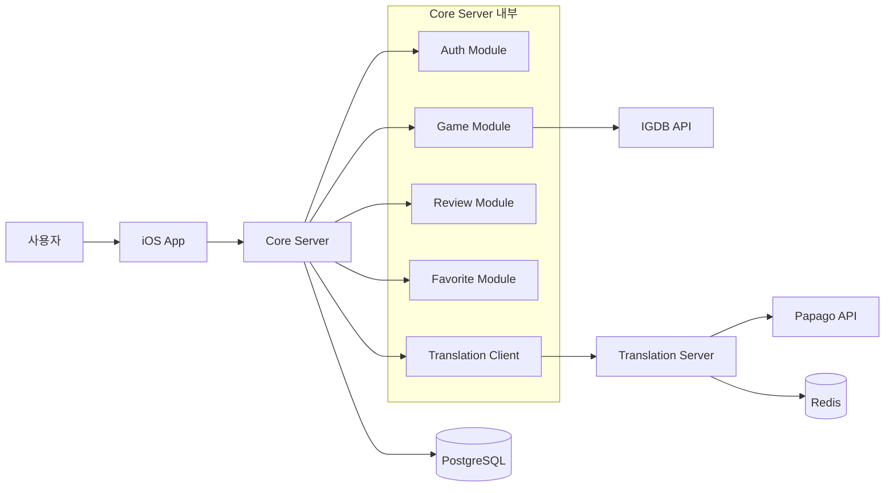
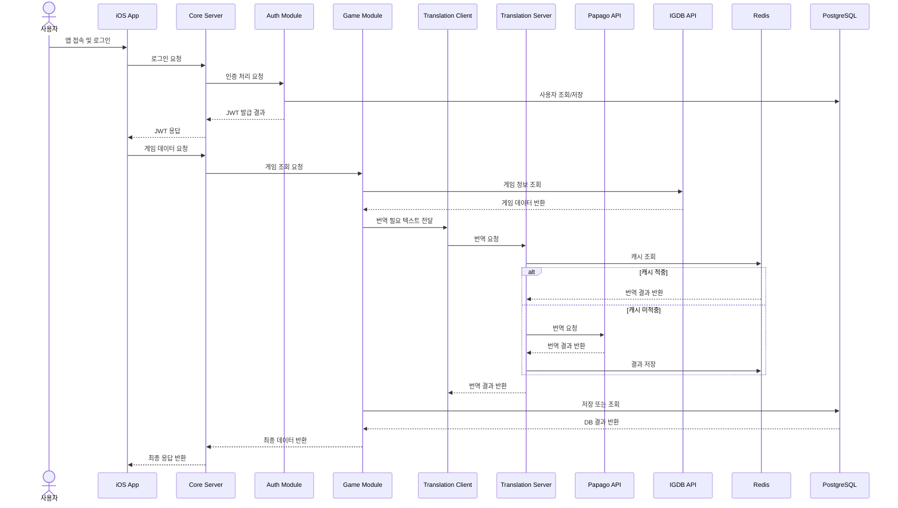

# GamePedia 시스템 아키텍처

## 문서 목적

이 문서는 최신 GamePedia 시스템 설계를 기준으로 전체 아키텍처를 설명한다. 특히 인증이 별도 서버가 아니라 `Core Server` 내부 `Auth Module`에서 처리된다는 점을 명확히 반영한다.

## 시스템 구성 개요

최신 시스템은 다음 구성 요소로 이루어진다.

| 구성 요소 | 설명 |
| --- | --- |
| iOS App | 사용자 인터페이스와 상태 관리를 담당하는 클라이언트 |
| Core Server | 메인 API 서버이며 인증과 도메인 기능을 모두 포함 |
| Translation Server | 번역 처리와 Redis 캐싱 전담 서버 |
| IGDB API | 외부 게임 정보 제공 API |
| Papago API | 외부 번역 API |
| PostgreSQL | 메인 영속 데이터 저장소 |
| Redis | 번역 결과 캐시 저장소 |

## Core Server 내부 모듈 구조

```text
Core Server
├── Auth Module
├── Game Module
├── Review Module
├── Favorite Module
└── Translation Client
```

| 모듈 | 역할 |
| --- | --- |
| Auth Module | JWT 발급, Apple Login, Google Login, Refresh Token 처리 |
| Game Module | 게임 목록 조회, 게임 상세 조회 |
| Review Module | 리뷰 생성, 리뷰 수정, 리뷰 삭제 |
| Favorite Module | 찜 추가, 찜 삭제, 찜 목록 조회 |
| Translation Client | Translation Server 호출 |

## 전체 시스템 구성도



## 다이어그램 설명

- 사용자는 `iOS App`을 통해 `Core Server`에 요청을 보낸다.
- 인증 요청은 `Core Server` 내부 `Auth Module`이 처리한다.
- 게임 정보는 `Game Module`이 `IGDB API`에서 조회하거나 `PostgreSQL`과 조합해 응답한다.
- 번역이 필요한 경우 `Translation Client`가 `Translation Server`를 호출한다.
- `Translation Server`는 `Papago API`를 호출하고 결과를 `Redis`에 캐싱한다.
- 사용자, 리뷰, 찜과 같은 영속 데이터는 `PostgreSQL`에 저장된다.

## 데이터 흐름 설명

### 표준 사용자 흐름

1. 사용자가 iOS App에 접속한다.
2. iOS App이 Core Server로 로그인 요청을 보낸다.
3. Core Server 내부 Auth Module이 JWT를 생성한다.
4. iOS App이 Core Server로 게임 데이터 요청을 보낸다.
5. Core Server의 Game Module이 IGDB API에서 게임 정보를 조회한다.
6. 번역이 필요한 경우 Core Server의 Translation Client가 Translation Server를 호출한다.
7. Translation Server가 Papago API를 호출한다.
8. Translation Server가 결과를 Redis에 캐싱한다.
9. Core Server가 PostgreSQL에 필요한 데이터를 저장하거나 조회한 뒤 응답을 반환한다.

## 상세 데이터 흐름 다이어그램



## 레이어 구조 설명

| 레이어 | 구성 요소 | 역할 |
| --- | --- | --- |
| Client Layer | iOS App | 사용자 입력, 화면 상태, API 호출 |
| API Layer | Core Server, Translation Server | 요청 수신과 응답 반환 |
| Module Layer | Auth, Game, Review, Favorite, Translation Client | 기능별 비즈니스 처리 |
| Persistence Layer | PostgreSQL, Redis | 데이터 저장과 캐싱 |
| External Layer | IGDB API, Papago API, Apple Login, Google Login | 외부 서비스 연동 |

## 책임 분리 설명

| 구성 요소 | 책임 | 비고 |
| --- | --- | --- |
| iOS App | 사용자 경험, 상태 관리, 토큰 저장 | 클라이언트 책임 |
| Core Server | 인증과 도메인 기능을 통합 제공 | 시스템 중심 서버 |
| Translation Server | 번역 API 호출과 캐시 관리 | 보조 서버 |
| PostgreSQL | 영속 데이터 저장 | 사용자, 리뷰, 찜 등 |
| Redis | 번역 결과 캐시 | Translation Server 전용 캐시 중심 |

## 확장성 고려 사항

- `Core Server`는 내부 모듈 분리로 인해 서버를 물리적으로 늘리지 않고도 코드 책임을 구분할 수 있다.
- 인증이 Core 내부에 있어도 `Auth Module`을 독립 모듈로 유지하면 추후 분리 가능성을 열어둘 수 있다.
- `Translation Server`는 별도 서버이므로 번역 부하가 증가해도 독립적으로 확장할 수 있다.
- `Redis` 캐시 적중률을 개선하면 Papago API 비용과 응답 시간을 동시에 줄일 수 있다.

## Pencil / Figma / FigJam용 다이어그램 구조

### 보드 구역

1. Client
2. Core Server
3. Core Modules
4. Translation Server
5. Storage
6. External APIs

### 박스 구성

- `iOS App`
- `Core Server`
- `Auth Module`
- `Game Module`
- `Review Module`
- `Favorite Module`
- `Translation Client`
- `Translation Server`
- `PostgreSQL`
- `Redis`
- `IGDB API`
- `Papago API`

### 화살표 규칙

- `iOS App -> Core Server`: 주 요청 흐름
- `Core Server -> 내부 모듈`: 기능 분기
- `Game Module -> IGDB API`: 게임 정보 조회
- `Translation Client -> Translation Server -> Papago API`: 번역 흐름
- `Translation Server -> Redis`: 캐시 읽기/쓰기
- `Core Server -> PostgreSQL`: 영속 데이터 저장/조회

### 시각적 강조

- `Auth Module`이 Core 내부에 있다는 점을 별도 박스보다 내부 서브그룹으로 강조한다.
- `Translation Server`는 별도 서버로 Core 바깥에 배치한다.
- `PostgreSQL`과 `Redis`는 역할이 다르므로 색상이나 아이콘을 구분한다.
