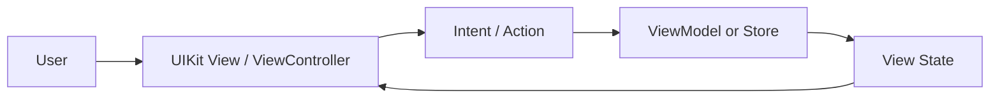
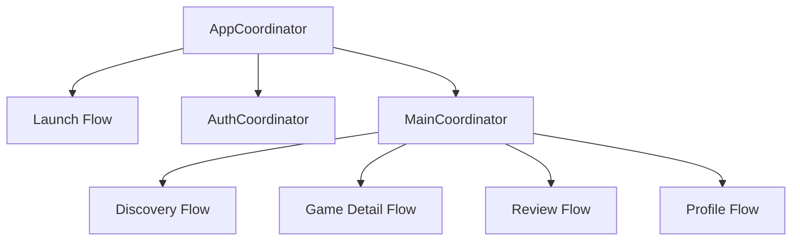

# GamePedia UI 구조 설계

## 문서 목적

이 문서는 GamePedia iOS 앱의 화면 구조, 화면 간 이동, UI 계층, 디자인 문서화 기준을 설명한다. Pencil, Figma, FigJam에서 바로 설계 보드로 옮길 수 있도록 화면 그룹과 연결 규칙도 함께 제공한다.

## 프로젝트 개요

UI 관점에서 GamePedia는 다음 사용자 흐름을 중심으로 설계된다.

- 앱 진입
- 로그인 또는 비로그인 탐색
- 게임 검색 및 목록 탐색
- 게임 상세 화면 진입
- 리뷰 작성/수정
- 프로필 및 사용자 정보 확인

## 기술 스택 정리

| 영역 | 기술 | 목적 |
| --- | --- | --- |
| UI 구현 | UIKit | 화면 구성과 상호작용 처리 |
| 상태 흐름 | Combine, MVI | UI 상태 전달과 비동기 바인딩 |
| 화면 이동 | Coordinator | 화면 전환 책임 분리 |
| 설계 도구 | Pencil, Figma, FigJam | 와이어프레임, 시각 설계, 아키텍처 보드 |

## 디렉터리 구조 설명

UI 설계는 실제 코드 디렉터리와 1:1 대응이 아니라, 아래의 논리 구조 기준으로 읽는다.

```text
GamePedia/
├── apps/ios
└── docs/02-design
```

| 경로 | 설명 |
| --- | --- |
| `apps/ios` | 실제 UI 구현이 존재하는 앱 영역 |
| `docs/02-design` | UI 구조, 보드 설계, 디자인 설명 문서 |

## UI 화면 그룹

| 그룹 | 포함 화면 | 목적 |
| --- | --- | --- |
| App Entry | Splash, Launch, Initial Routing | 로그인 상태와 초기 진입 분기 |
| Auth | Login, OAuth Callback, Session Restore | 인증 시작 및 세션 복원 |
| Discovery | Home, Search, Game List | 게임 탐색 |
| Detail | Game Detail, Review List | 게임/리뷰 정보 조회 |
| Review | Write Review, Edit Review | 사용자 입력 중심 화면 |
| Profile | My Page, Settings, Account | 사용자 정보와 설정 |

## UI 데이터 흐름 다이어그램



UI 설계 문서에서는 화면 자체보다도 "사용자 입력이 어떤 상태 변경으로 이어지는지"가 중요하다. 따라서 화면 박스와 상태 박스를 함께 배치하는 것이 좋다.

## Coordinator 기반 화면 흐름



Coordinator는 "무엇을 보여줄지"를 결정하지만 "무엇을 계산할지"는 결정하지 않는다. 이 점이 UI 구조에서 가장 중요한 분리 기준이다.

## 레이어 구조 설명

| 레이어 | 책임 | 예시 |
| --- | --- | --- |
| Screen Layer | 화면 배치, 이벤트 수집, 렌더링 | ViewController, View |
| Navigation Layer | 화면 전환, 진입 분기 | AppCoordinator, FeatureCoordinator |
| State Layer | 화면 상태 생성과 갱신 | ViewModel, Store, State |
| Domain Hook Layer | 기능 실행 요청 | UseCase |
| Design Reference Layer | 화면 명세와 보드 설계 | Pencil/Figma/FigJam |

## 책임 분리 설명

| 구성 요소 | 담당 책임 | 담당하지 않는 것 |
| --- | --- | --- |
| View / ViewController | 사용자 입력 수집, 상태 렌더링 | 비즈니스 로직, 네트워크 규칙 |
| Coordinator | 화면 이동, 진입 조건 분기 | 화면 상태 계산 |
| ViewModel / Store | 상태 생성, Action 처리 | 직접적인 화면 푸시/프레젠트 |
| UseCase | 기능 실행, 도메인 흐름 연결 | 구체적인 UI 배치 |
| Design Docs | 화면 구조 설명, 컴포넌트 관계 시각화 | 런타임 상태 저장 |

## UI 확장성 고려 사항

- 화면이 늘어나도 Coordinator 단위로 플로우를 분리하면 네비게이션 변경 범위를 줄일 수 있다.
- MVI 상태 구조를 유지하면 로딩/에러/빈 상태를 일관되게 확장할 수 있다.
- 공통 UI 컴포넌트와 화면 그룹을 분리해 디자인 변경 시 영향 범위를 제어할 수 있다.
- FigJam/Pencil 보드는 개요용, Figma는 상세 화면용으로 역할을 분리하면 문서 과밀화를 막을 수 있다.

## Pencil / Figma / FigJam용 보드 구조

### 프레임 구분

1. App Entry
2. Auth Flow
3. Discovery Flow
4. Game Detail / Review Flow
5. Profile / Settings
6. Shared UI Notes

### 박스 구성

- 화면은 직사각형 카드
- Coordinator는 상단에 둔 라우팅 박스
- State는 화면 아래 작은 설명 박스
- 공통 컴포넌트는 옆에 태그 형태로 배치

### 화살표 규칙

- 실선: 기본 화면 이동
- 점선: 조건부 이동
- 양방향 점선: 상태 갱신과 화면 재렌더링 관계

### 시각적 강조

- 로그인 전/후 분기
- Discovery에서 Detail로 이어지는 주 경로
- 리뷰 작성처럼 인증이 필요한 액션
