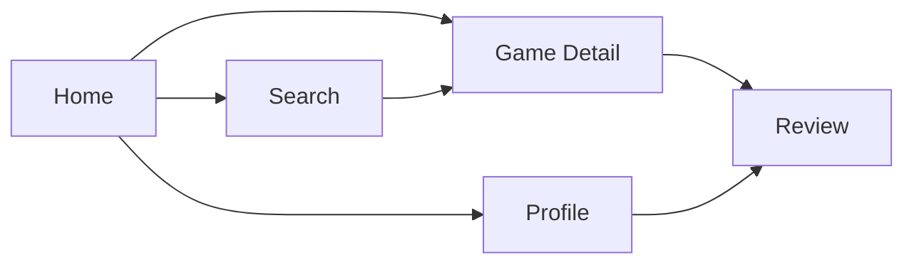
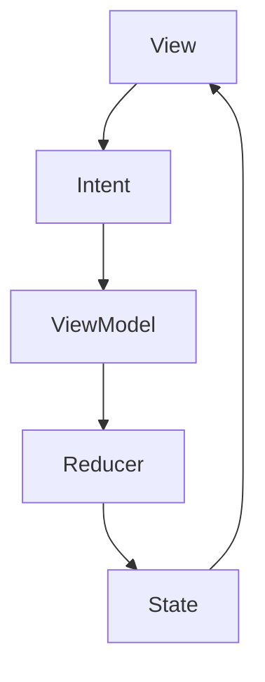

# GamePedia UI 구조

## 문서 목적

이 문서는 GamePedia iOS 앱의 주요 화면 구조와 UI 계층 구조, 디자인 시스템 방향을 정리한다. Home, Search, Game Detail, Review, Profile 화면이 어떤 관계를 가지는지 한눈에 파악할 수 있도록 구성한다.

## UI 구조 개요

GamePedia의 주요 사용자 흐름은 다음 화면을 중심으로 구성된다.

- Home
- Search
- Game Detail
- Review
- Profile

## 주요 화면 구조

| 화면 | 목적 | 주요 기능 |
| --- | --- | --- |
| Home | 앱 진입 후 기본 게임 탐색 시작점 | 추천 게임, 인기 게임, 최근 탐색 진입 |
| Search | 원하는 게임 검색 | 키워드 검색, 결과 목록, 필터 |
| Game Detail | 게임 상세 정보 확인 | 게임 정보, 설명, 번역 텍스트, 리뷰 진입 |
| Review | 리뷰 확인 및 작성/수정/삭제 | 리뷰 목록, 작성 폼, 수정, 삭제 |
| Profile | 사용자 정보와 개인화 영역 | 내 리뷰, 찜 목록, 계정 정보 |

## 화면 흐름 다이어그램



## UI 계층 구조 설명

GamePedia UI는 다음 계층을 기준으로 설계한다.

| 계층 | 구성 요소 | 역할 |
| --- | --- | --- |
| Screen Layer | ViewController, View | 화면 구성, 사용자 이벤트 수집 |
| State Layer | ViewModel, State, Intent, Reducer | 화면 상태 생성과 갱신 |
| Flow Layer | Coordinator | 화면 이동과 진입 흐름 제어 |
| Domain Hook Layer | UseCase | 기능 실행 요청 |
| Data Hook Layer | Repository | 서버 및 캐시 접근 연결 |

## 화면별 UI 책임

| 화면 | UI 책임 | 서버 연동 포인트 |
| --- | --- | --- |
| Home | 메인 피드 렌더링 | Core Server Game Module |
| Search | 검색 입력과 결과 표시 | Core Server Game Module |
| Game Detail | 상세 정보와 번역 콘텐츠 표시 | Core Server + Translation Server 간접 사용 |
| Review | 리뷰 목록과 편집 폼 | Core Server Review Module |
| Profile | 사용자 정보와 찜 목록 표시 | Core Server Auth/Favorite Module |

## 디자인 시스템 설명

GamePedia의 디자인 시스템은 다음 원칙을 따른다.

### 공통 컴포넌트

| 컴포넌트 | 설명 |
| --- | --- |
| Navigation Bar | 화면 제목과 뒤로가기, 주요 액션 제공 |
| Game Card | 게임 목록과 추천 리스트에서 공통 사용 |
| Search Bar | 검색 입력과 결과 진입 공통 사용 |
| Review Card | 리뷰 목록과 프로필 화면에서 재사용 |
| Empty / Loading / Error View | 상태별 공통 피드백 UI |
| Favorite Button | 찜 추가/삭제 액션 공통 UI |

### 상태 표현 원칙

- 로딩 상태는 공통 Loading UI로 통일한다.
- 빈 결과 상태는 Empty View로 통일한다.
- 오류 상태는 재시도 액션이 있는 Error View로 통일한다.
- 인증이 필요한 화면 진입은 Coordinator에서 분기한다.

## UI 데이터 흐름 다이어그램



## 디렉터리 구조 설명

```text
apps/ios
├── Features
│   ├── Home
│   ├── Search
│   ├── GameDetail
│   ├── Review
│   └── Profile
├── Coordinators
└── Shared
```

| 영역 | 설명 |
| --- | --- |
| `Features/*` | 화면별 UI, ViewModel, State 구성 |
| `Coordinators` | 화면 흐름과 라우팅 |
| `Shared` | 공통 컴포넌트와 디자인 시스템 자산 |

## 책임 분리 설명

| 구성 요소 | 책임 | 제외 책임 |
| --- | --- | --- |
| View | 사용자 입력과 렌더링 | 비즈니스 로직 |
| ViewModel | 상태 조립, 이벤트 처리 | 직접적인 화면 푸시 |
| Reducer | 상태 변경 규칙 | 네트워크 접근 |
| Coordinator | 화면 전환과 진입 분기 | 상태 계산 |
| Shared UI | 공통 컴포넌트 재사용 | 기능별 비즈니스 규칙 |

## 확장성 고려 사항

- 화면이 늘어나더라도 Feature 단위 분리로 UI 복잡도를 제어할 수 있다.
- 공통 컴포넌트를 `Shared`로 유지하면 일관된 디자인 시스템 운영이 가능하다.
- 화면별 State와 Intent를 분리하면 기능 확장 시 회귀 범위를 줄일 수 있다.
- Coordinator 중심 네비게이션 구조는 로그인 필요 흐름이나 모달 분기를 안정적으로 확장할 수 있다.

## Pencil / Figma / FigJam용 보드 구조

### 프레임 구성

1. Home
2. Search
3. Game Detail
4. Review
5. Profile
6. Shared Components

### 배치 규칙

- 왼쪽에서 오른쪽으로 `Home -> Search -> Game Detail -> Review`
- `Profile`은 Home 또는 상단 탭 구조의 별도 가지로 배치
- 공통 컴포넌트는 하단 또는 우측에 모아 표시

### 시각적 강조

- `Game Detail`을 중심 허브로 배치해 검색과 리뷰 흐름의 연결을 드러낸다.
- `Review`와 `Favorite` 관련 액션은 인증 필요 표시를 함께 둔다.
- 공통 상태 UI는 별도 영역에 묶어 디자인 시스템 재사용성을 보여준다.
