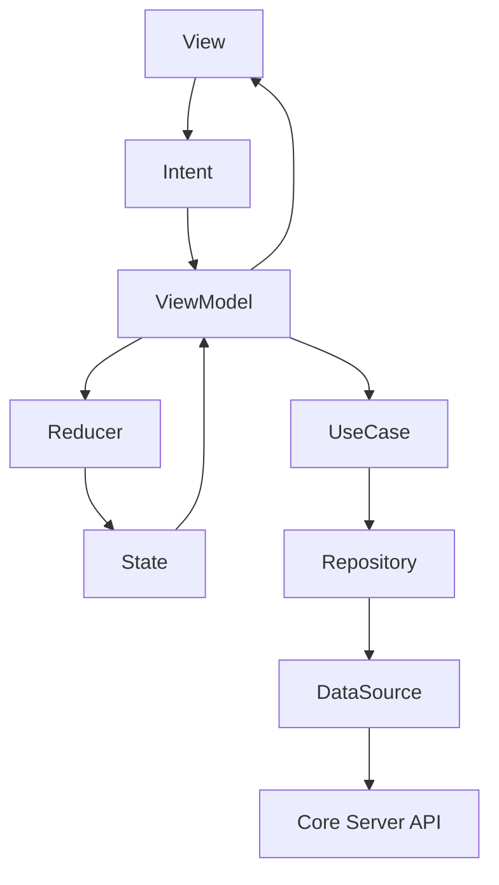
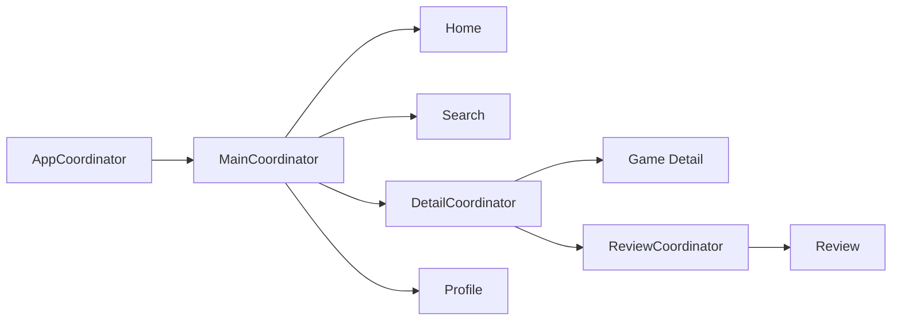
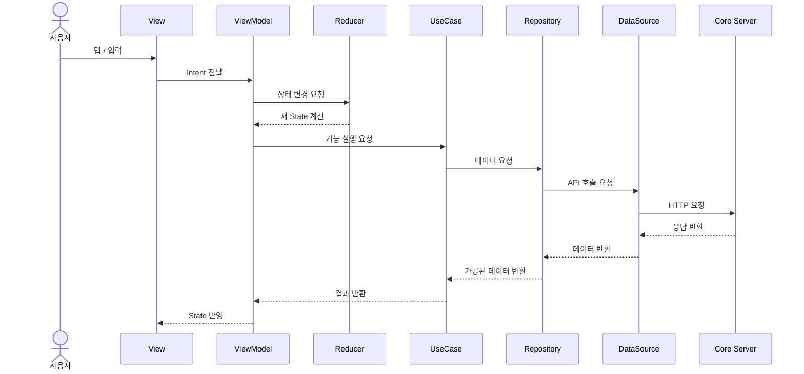

# GamePedia iOS 아키텍처

## 문서 목적

이 문서는 GamePedia iOS 앱의 MVI 구조와 Coordinator 패턴, 그리고 서버까지 이어지는 데이터 흐름을 설명한다. View부터 DataSource까지의 계층을 명확히 정리해 화면 로직과 데이터 로직의 경계를 이해할 수 있도록 한다.

## 기술 스택 정리

| 영역 | 기술 |
| --- | --- |
| UI | UIKit |
| 이벤트 / 바인딩 | Combine |
| 상태 관리 | MVI |
| 화면 전환 | Coordinator |
| 도메인 계층 | UseCase (유즈케이스) |
| 데이터 계층 | Repository (레포지토리), DataSource (데이터소스) |

## MVI 구조 설명

GamePedia iOS 앱은 다음 구성 요소로 상태를 관리한다.

| 구성 요소 | 역할 |
| --- | --- |
| View | 사용자 입력을 받고 화면을 렌더링 |
| Intent | 사용자의 액션을 의도(Intent)로 변환 |
| State | 화면이 표현할 현재 상태 |
| Reducer | Intent와 결과를 기반으로 State를 변경 |
| ViewModel | 상태 흐름 제어, UseCase 호출, View 바인딩 |
| UseCase | 기능 단위 비즈니스 흐름 실행 |
| Repository | 데이터 조회/저장 정책 추상화 |
| DataSource | 실제 API 호출, 캐시 접근, 로컬 저장 처리 |

## iOS 아키텍처 구조도



## Coordinator 패턴 설명

Coordinator는 화면 전환과 진입 분기를 담당한다.

| Coordinator | 역할 |
| --- | --- |
| AppCoordinator | 앱 시작, 로그인 여부 판단, 루트 흐름 제어 |
| MainCoordinator | Home, Search, Profile 등 주요 화면 전환 |
| DetailCoordinator | Game Detail 관련 화면 흐름 |
| ReviewCoordinator | 리뷰 작성/수정/삭제 흐름 |

Coordinator 설계 원칙은 다음과 같다.

- ViewController는 직접 다른 화면을 push/present하지 않는다.
- 로그인 필요 여부와 같은 진입 조건은 Coordinator에서 판단한다.
- 화면 흐름과 상태 흐름을 분리해 테스트와 유지보수를 쉽게 한다.

## Coordinator 흐름 다이어그램



## 데이터 흐름 설명

사용자 액션에서 서버 응답까지의 흐름은 다음과 같다.

1. 사용자가 View에서 액션을 발생시킨다.
2. View는 액션을 Intent로 변환해 ViewModel에 전달한다.
3. ViewModel은 Reducer와 UseCase를 사용해 상태 변경과 비즈니스 실행을 분리한다.
4. UseCase는 Repository를 호출한다.
5. Repository는 필요한 DataSource를 통해 Core Server와 통신한다.
6. 응답 결과가 다시 ViewModel로 돌아와 State를 갱신한다.
7. View는 새로운 State를 반영해 화면을 다시 그린다.

## 데이터 흐름 다이어그램



## 디렉터리 구조 설명

```text
apps/ios
├── App
├── Coordinators
├── Features
├── Domain
├── Data
└── Shared
```

| 경로 | 설명 |
| --- | --- |
| `App` | 앱 시작점, 의존성 조립 |
| `Coordinators` | 화면 흐름과 라우팅 제어 |
| `Features` | View, ViewModel, State, Intent, Reducer |
| `Domain` | UseCase, Entity, 정책 |
| `Data` | Repository, DataSource, 네트워크 계층 |
| `Shared` | 공통 UI, 유틸리티, 네트워크 공통 코드 |

## 레이어 구조 설명

| 레이어 | 구성 요소 | 책임 |
| --- | --- | --- |
| Presentation Layer | View, ViewController | 사용자 입력, 렌더링 |
| State Layer | Intent, Reducer, State, ViewModel | 상태 생성과 갱신 |
| Navigation Layer | Coordinator | 화면 이동과 진입 조건 분기 |
| Domain Layer | UseCase | 기능 단위 비즈니스 흐름 |
| Data Layer | Repository, DataSource | 서버 통신과 데이터 조회/저장 |

## 책임 분리 설명

| 구성 요소 | 책임 | 담당하지 않는 것 |
| --- | --- | --- |
| View | 이벤트 수집, 화면 표시 | 도메인 로직, 데이터 접근 |
| ViewModel | Intent 처리, UseCase 호출, State 반영 | 직접적인 네비게이션 제어 |
| Reducer | 상태 변경 규칙 정의 | API 호출 |
| UseCase | 비즈니스 흐름 구성 | UI 표현 |
| Repository | 데이터 접근 정책 결정 | 화면 상태 계산 |
| DataSource | 실제 원격/로컬 입출력 | 비즈니스 정책 |
| Coordinator | 화면 전환, 로그인 분기 | 상태 계산, 데이터 조합 |

## 확장성 고려 사항

- MVI 구조를 유지하면 로딩/성공/실패 상태를 기능마다 일관되게 확장할 수 있다.
- UseCase와 Repository 분리로 테스트 대역(Mock) 구성이 쉽다.
- Coordinator를 통해 복잡한 화면 흐름을 기능별로 분리할 수 있다.
- DataSource 분리로 향후 캐시 전략이나 네트워크 구현 변경 시 영향 범위를 줄일 수 있다.
- 번역 기능도 iOS가 직접 번역 서버를 호출하지 않고 Core Server를 통해 우회하도록 유지하면 API 경계가 단순해진다.

## Pencil / Figma / FigJam용 다이어그램 구조

### 포함할 박스

- View
- Intent
- ViewModel
- Reducer
- State
- UseCase
- Repository
- DataSource
- Coordinator
- Core Server

### 배치 방식

- 상단에 Coordinator 흐름
- 중앙에 MVI 상태 루프
- 하단에 UseCase / Repository / DataSource
- 우측에 Core Server

### 시각적 강조

- `Intent -> ViewModel -> Reducer -> State -> View` 루프
- `Coordinator`는 상태 루프 바깥에서 화면 이동만 담당한다는 점
- 외부 API 접근은 `DataSource` 아래에서만 일어난다는 점
