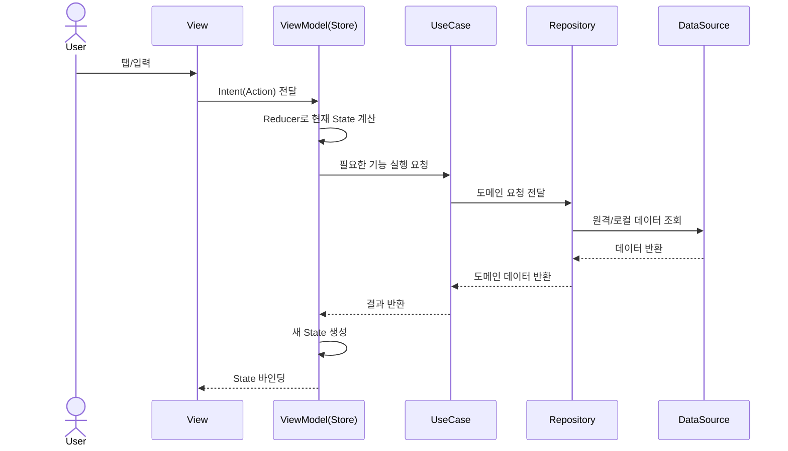
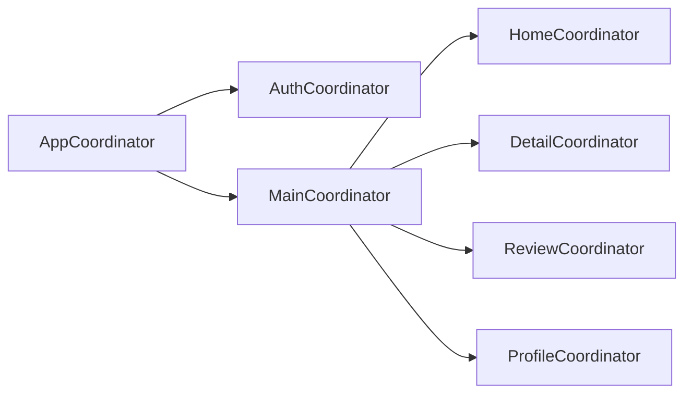

# GamePedia iOS 아키텍처

## 문서 목적

이 문서는 GamePedia iOS 앱의 내부 아키텍처를 설명한다. UIKit, Combine, MVI, Coordinator, UseCase, Repository 패턴이 어떻게 결합되어 동작하는지와 클라이언트 내부 데이터 흐름을 명확히 정리한다.

## 프로젝트 개요

GamePedia iOS 앱은 화면 전환과 상태 관리를 분리한 구조를 채택한다.

- 화면 이동은 `Coordinator`
- 화면 상태는 `MVI`
- 비즈니스 실행은 `UseCase`
- 데이터 접근은 `Repository`
- 실제 통신/저장은 `DataSource`

## 기술 스택 정리

| 영역 | 기술 | 설명 |
| --- | --- | --- |
| UI | UIKit | ViewController 중심 화면 구성 |
| Reactive | Combine | 이벤트 및 비동기 스트림 처리 |
| State | MVI | Action -> Reducer -> State 흐름 유지 |
| Navigation | Coordinator | 화면 전환 책임 분리 |
| Domain | UseCase | 기능별 비즈니스 실행 |
| Data | Repository, DataSource | API/캐시/저장소 접근 추상화 |

## 디렉터리 구조 설명

실제 코드가 어떤 폴더명을 쓰더라도, 아키텍처는 아래 논리 구조로 이해한다.

```text
apps/ios
├── App
├── Coordinators
├── Features
├── Domain
├── Data
└── Shared
```

| 논리 영역 | 설명 |
| --- | --- |
| `App` | 앱 시작점, DI 조립, 초기 라우팅 |
| `Coordinators` | 앱/기능 단위 화면 흐름 |
| `Features` | 화면, ViewModel(Store), Intent, State |
| `Domain` | UseCase, Entity, Domain 규칙 |
| `Data` | Repository, Remote/Local DataSource |
| `Shared` | 공통 UI, 유틸리티, 네트워크 기반 요소 |

## iOS 아키텍처 구조도

```mermaid
flowchart TD
    View[View / ViewController] --> Action[Intent(Action)]
    Action --> VM[ViewModel(Store)]
    VM --> Reducer[Reducer]
    Reducer --> State[State]
    State --> VM
    VM --> View

    VM --> UseCase[UseCase]
    UseCase --> Repository[Repository]
    Repository --> RemoteDS[Remote DataSource]
    Repository --> LocalDS[Local DataSource / Cache]

    RemoteDS --> AuthAPI[Auth Server API]
    RemoteDS --> CoreAPI[Core Server API]
    RemoteDS --> TranslationAPI[Translation Server API]
```

이 구조의 핵심은 화면 계층이 Repository 이하 구현 상세를 직접 알지 않는다는 점이다.

## MVI 데이터 흐름 정리



## Coordinator 기반 화면 흐름



Coordinator는 기능별 흐름을 라우팅하고, ViewModel은 각 화면의 상태를 유지한다.

## 레이어 구조 설명

| 레이어 | 주요 구성 | 책임 |
| --- | --- | --- |
| Presentation | View, ViewController | 렌더링, 입력 수집 |
| Navigation | Coordinator | 화면 이동, 진입 분기 |
| State | Intent, ViewModel(Store), Reducer, State | 상태 생성과 갱신 |
| Domain | UseCase | 기능 흐름과 도메인 규칙 |
| Data | Repository, DataSource | 데이터 소스 선택과 접근 |

## 책임 분리 설명

| 구성 요소 | 책임 | 비책임 |
| --- | --- | --- |
| View | 이벤트 전달, 상태 표현 | 비즈니스 로직, 데이터 접근 |
| ViewModel(Store) | Action 처리, State 생성 | 화면 전환 직접 제어 |
| Reducer | 상태 변경 규칙 정의 | 네트워크 호출 |
| UseCase | 비즈니스 실행 흐름 제어 | UI 렌더링 |
| Repository | 데이터 접근 추상화 | 화면 상태 계산 |
| DataSource | API/캐시 실제 입출력 | 도메인 규칙 |
| Coordinator | 네비게이션 | API 호출, 상태 계산 |

## 확장성 고려 사항

- 새로운 화면은 Coordinator에 플로우를 추가하고 Feature 단위로 분리하면 된다.
- UseCase와 Repository가 분리되어 테스트 대역과 모듈 확장이 쉽다.
- Remote/Local DataSource를 분리하면 오프라인 대응과 캐시 전략 확장이 쉬워진다.
- MVI는 상태 변경 지점을 한곳으로 모아 디버깅과 리팩터링 비용을 줄인다.

## Pencil / Figma / FigJam용 다이어그램 구조

### 박스 배치

- 상단: Coordinator 흐름
- 중단: View, ViewModel(Store), Reducer, State
- 하단: UseCase, Repository, DataSource
- 우측: Auth/Core/Translation API

### 강조 포인트

- Action -> Reducer -> State 루프
- Coordinator와 State 관리의 분리
- Repository 아래에서만 외부 API를 알 수 있다는 점

### 화살표 규칙

- 굵은 실선: 주요 런타임 흐름
- 점선: 상태 바인딩 또는 보조 관계
- 그룹 테두리: Feature 단위 모듈
