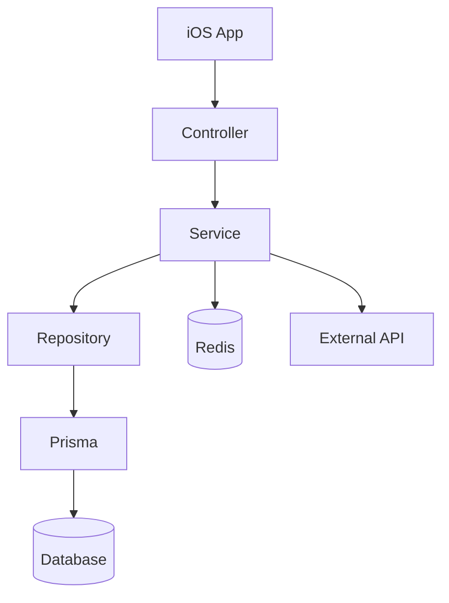
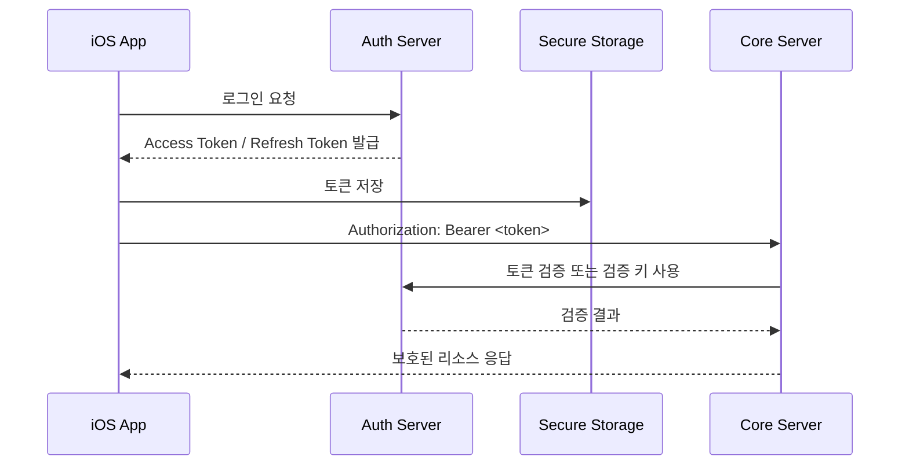
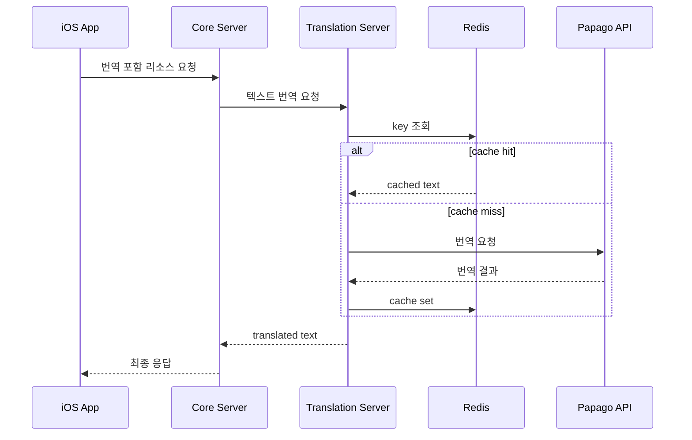

# GamePedia 서버 아키텍처

## 문서 목적

이 문서는 `core`, `auth`, `translation` 서버가 어떤 계층 구조를 가지고 어떻게 협력하는지 설명한다. Node.js + Express 기반의 API 구조, Prisma 기반 데이터 접근, JWT 인증 경계, Redis 캐싱 전략까지 서버 관점에서 정리한다.

## 프로젝트 개요

GamePedia 서버는 세 가지 책임으로 분리된다.

- `Auth Server`: 로그인, OAuth, JWT 발급/검증
- `Core Server`: 게임/리뷰/사용자 도메인 API
- `Translation Server`: 번역 요청, Papago 호출, Redis 캐시

## 기술 스택 정리

| 서비스 | 기술 스택 | 핵심 역할 |
| --- | --- | --- |
| Core | Node.js, Express, Prisma | 도메인 API, DB 연동 |
| Auth | Node.js, Express, JWT, OAuth | 인증, 토큰, 외부 로그인 |
| Translation | Node.js, Papago API, Redis | 번역, 캐시 |
| 공통 품질 | Winston logger | 구조화 로그 |

## 디렉터리 구조 설명

```text
servers/
├── core
├── auth
└── translation
```

각 서버는 내부적으로 다음 레이어 구조로 이해한다.

```text
server/
├── controllers
├── services
├── repositories
├── datasources or integrations
└── infrastructure
```

| 레이어 | 설명 |
| --- | --- |
| Controller | HTTP 요청/응답 변환, validation 진입점 |
| Service | 비즈니스 로직, 유스케이스 흐름 |
| Repository | DB 또는 외부 저장 접근 추상화 |
| Integration | OAuth, IGDB, Papago, Redis 등 외부 연동 |
| Infrastructure | Logger, config, middleware, auth helpers |

## 서버 구조도



이 구조의 기본 원칙은 HTTP 계층과 비즈니스 로직, 데이터 접근을 분리하는 것이다.

## 서비스별 역할 분리

| 서비스 | Controller 역할 | Service 역할 | Repository / Integration 역할 |
| --- | --- | --- | --- |
| Core | 게임/리뷰/사용자 API 진입점 | 도메인 규칙, 응답 조합 | Prisma로 DB 접근, Translation/IGDB 연동 |
| Auth | 로그인/토큰 API 진입점 | 사용자 인증, JWT 생성, OAuth 처리 | 사용자 저장, OAuth provider 연동 |
| Translation | 번역 API 진입점 | 캐시 우선 번역 처리 | Redis 접근, Papago 연동 |

## API 구조 설계

| 서버 | API 범주 | 예시 책임 |
| --- | --- | --- |
| Auth | `/auth/*` | 로그인, 콜백, 토큰 발급, 토큰 갱신, 토큰 검증 |
| Core | `/games/*`, `/reviews/*`, `/users/*` | 게임 조회, 리뷰 CRUD, 사용자 데이터 |
| Translation | `/translate/*` 또는 내부 API | 번역 요청, 번역 결과 반환, 캐시 활용 |

API 설계 원칙은 다음과 같다.

- 인증 관련 경로는 Auth Server에만 둔다.
- 게임과 리뷰 API는 Core Server에 집중한다.
- Translation Server는 내부 보조 API 성격을 유지한다.

## JWT 인증 구조 정리



JWT 구조에서 중요한 점은 다음과 같다.

- iOS는 토큰을 안전한 저장소에 보관한다.
- Core Server는 인증의 원천을 소유하지 않고 검증 결과만 신뢰한다.
- Refresh 흐름은 Auth Server가 단독으로 소유한다.

## 번역 시스템 흐름 정리



## Redis 캐싱 전략 정리

기본 전략은 `cache-aside`가 적합하다.

| 항목 | 전략 |
| --- | --- |
| 캐시 키 | `translate:{sourceLang}:{targetLang}:{hash(text)}` |
| 조회 순서 | Redis 조회 후 miss 시 Papago 호출 |
| 저장 시점 | Papago 응답 직후 |
| 만료 정책 | TTL 기반 만료, 필요 시 수동 무효화 |
| 측정 포인트 | hit rate, miss rate, translation latency |

Redis 캐싱의 목적은 다음과 같다.

- 반복 번역 비용 감소
- 외부 API 지연 감소
- 동일 텍스트에 대한 응답 일관성 확보

## 레이어 구조 설명

| 레이어 | 역할 | 서버별 예시 |
| --- | --- | --- |
| API Layer | HTTP 요청 수신/응답 | Express Controller |
| Domain Layer | 비즈니스 규칙 실행 | Auth logic, review rules, translation flow |
| Persistence Layer | DB/Cache 접근 | Prisma Repository, Redis access |
| Integration Layer | 외부 서비스 연동 | OAuth, IGDB, Papago |
| Cross-Cutting Layer | 로깅, 설정, 인증 middleware | Winston, config, JWT helper |

## 책임 분리 설명

| 구성 요소 | 책임 | 분리 이유 |
| --- | --- | --- |
| Auth Server | 사용자 식별, 토큰 수명주기 | 보안 경계를 분리하기 위해 |
| Core Server | 비즈니스 API와 도메인 조합 | 기능 확장의 중심을 명확히 하기 위해 |
| Translation Server | 번역 및 캐시 | 비용/성능 최적화 책임을 독립시키기 위해 |
| Repository | 저장소 접근 추상화 | Service가 DB 구현 상세를 모르도록 하기 위해 |
| Winston Logger | 구조화 로그 기록 | 장애 분석과 추적성을 높이기 위해 |

## 확장성 고려 사항

- Core/Auth/Translation을 독립 배포 가능하게 유지하면 서비스별 스케일 전략이 가능하다.
- Prisma Repository를 공통 패턴으로 사용하면 도메인 기능 확장 시 코드 일관성이 높다.
- Redis를 Translation 전용 캐시로 유지하면 번역 트래픽이 증가해도 Core Server 부하를 분리할 수 있다.
- Controller/Service/Repository 구조는 테스트와 리팩터링 경계를 분명하게 해준다.
- Winston 구조화 로그를 유지하면 다중 인스턴스 환경에서도 추적이 쉬워진다.

## Pencil / Figma / FigJam용 다이어그램 구조

### 그룹

1. Auth Server
2. Core Server
3. Translation Server
4. Storage
5. External Integrations

### 박스 구성

- 각 서버는 `Controller -> Service -> Repository` 세로 스택
- DB와 Redis는 서버 하단
- IGDB, OAuth, Papago는 오른쪽 외부 영역

### 화살표 규칙

- 세로 실선: 서버 내부 계층 흐름
- 우측 화살표: 외부 연동
- 하향 화살표: 저장소 접근
- 서버 간 화살표: Core -> Translation, Core -> Auth 검증

### 시각적 강조

- Auth는 보안 색상, Core는 도메인 색상, Translation은 지원 서비스 색상으로 분리
- Redis는 Translation 옆에 붙여 캐시 우선 구조를 즉시 이해할 수 있게 한다
