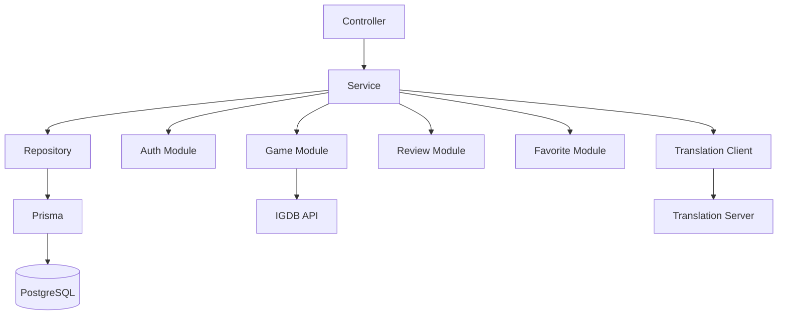
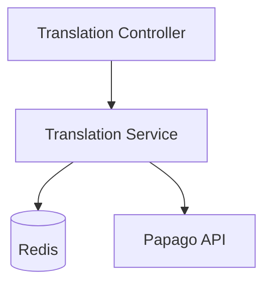
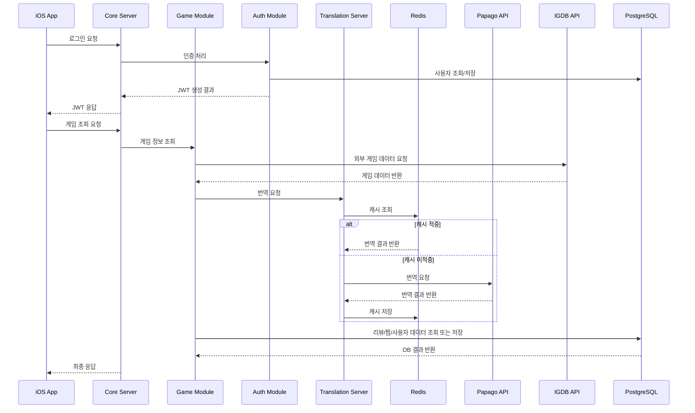

# GamePedia 서버 아키텍처

## 문서 목적

이 문서는 최신 서버 구조를 기준으로 `Core Server`와 `Translation Server`의 역할을 설명한다. `Auth Module`이 Core Server 내부 모듈이라는 점을 중심으로 모듈 구조, 계층 구조, Redis 캐싱 전략을 정리한다.

## 서버 구성 개요

GamePedia 서버는 두 개의 서버로 구성된다.

| 서버 | 역할 |
| --- | --- |
| Core Server | 인증, 게임, 리뷰, 찜 기능을 제공하는 메인 서버 |
| Translation Server | 번역 처리와 Redis 캐싱을 담당하는 별도 서버 |

## 기술 스택 정리

| 영역 | 기술 |
| --- | --- |
| Core Server | Node.js, Express, Prisma, JWT, Winston |
| Translation Server | Node.js, Express, Redis, Papago API, Winston |
| Database | PostgreSQL |
| Cache | Redis |

## Core Server 구조 설명

### 계층 구조

```text
Core Server
├── Controller
├── Service
├── Repository
└── Prisma
```

| 계층 | 역할 |
| --- | --- |
| Controller | HTTP 요청/응답 처리, 입력 검증 진입점 |
| Service | 비즈니스 로직 실행, 모듈 간 조합 |
| Repository | PostgreSQL 접근 추상화 |
| Prisma | DB 모델 매핑과 쿼리 실행 |

### 모듈 구조

```text
Core Server
├── Auth Module
├── Game Module
├── Review Module
├── Favorite Module
└── Translation Client
```

| 모듈 | 설명 |
| --- | --- |
| Auth Module | JWT 발급, Apple Login, Google Login, Refresh Token 처리 |
| Game Module | 게임 목록 조회, 게임 상세 조회 |
| Review Module | 리뷰 생성, 수정, 삭제 |
| Favorite Module | 찜 추가, 삭제, 목록 조회 |
| Translation Client | Translation Server 호출 |

## Core Server 구조도



## Translation Server 구조 설명

Translation Server는 번역 요청을 전담 처리한다.

| 구성 요소 | 역할 |
| --- | --- |
| Translation Controller | 번역 요청 수신, 응답 반환 |
| Translation Service | 캐시 확인, Papago 호출 판단 |
| Redis Client | 캐시 읽기/쓰기 |
| Papago Integration | Papago API 호출 |

## Translation Server 구조도



## Redis 캐싱 전략 설명

GamePedia의 번역 캐싱은 `cache-aside` 전략을 사용한다.

### 기본 흐름

1. Translation Server가 Redis에서 먼저 번역 결과를 조회한다.
2. 캐시가 있으면 Redis 결과를 그대로 반환한다.
3. 캐시가 없으면 Papago API를 호출한다.
4. 번역 결과를 Redis에 저장한다.
5. 이후 동일 요청은 캐시에서 빠르게 응답한다.

### 캐싱 정책

| 항목 | 전략 |
| --- | --- |
| 캐시 키 | `translate:{source}:{target}:{hash(text)}` |
| 조회 우선순위 | Redis 우선 |
| 저장 시점 | Papago 응답 직후 |
| 만료 방식 | TTL 기반 만료 |
| 기대 효과 | 응답 속도 향상, Papago 호출량 감소 |

## 서버 간 데이터 흐름 설명



## 디렉터리 구조 설명

```text
servers/
├── core
└── translation
```

| 경로 | 설명 |
| --- | --- |
| `servers/core` | 인증과 도메인 기능이 포함된 메인 서버 |
| `servers/translation` | 번역 처리와 Redis 캐시를 담당하는 별도 서버 |

## 책임 분리 설명

| 구성 요소 | 책임 | 분리 이유 |
| --- | --- | --- |
| Core Server | API의 메인 진입점, 도메인 처리, 인증 처리 | 사용자 기능을 한 서버에서 일관되게 제공하기 위해 |
| Auth Module | 인증과 토큰 수명주기 관리 | 인증 로직을 모듈 단위로 분리하기 위해 |
| Game Module | 게임 데이터 조회 | 게임 기능의 책임을 독립시키기 위해 |
| Review Module | 리뷰 CRUD | 리뷰 도메인 규칙을 분리하기 위해 |
| Favorite Module | 찜 기능 처리 | 개인화 기능을 독립적으로 관리하기 위해 |
| Translation Server | 번역 처리와 캐싱 | 번역 부하를 분리하고 성능을 최적화하기 위해 |

## 확장성 고려 사항

- Core Server 내부 모듈 분리로 코드 수준의 응집도와 유지보수성을 높일 수 있다.
- 추후 인증 규모가 커지더라도 Auth Module을 별도 서비스로 분리하기 쉬운 구조를 유지할 수 있다.
- Translation Server는 별도 서버이므로 번역 트래픽 증가 시 독립 확장이 가능하다.
- Prisma를 Repository 계층 아래에 두어 DB 접근 방식이 바뀌더라도 상위 계층 영향을 줄일 수 있다.
- Redis TTL과 캐시 키 전략을 개선해 번역 비용 최적화를 지속할 수 있다.

## Pencil / Figma / FigJam용 다이어그램 구조

### 박스 구성

- `Core Server`
- `Controller`
- `Service`
- `Repository`
- `Prisma`
- `Auth Module`
- `Game Module`
- `Review Module`
- `Favorite Module`
- `Translation Client`
- `Translation Server`
- `PostgreSQL`
- `Redis`
- `IGDB API`
- `Papago API`

### 배치 규칙

- Core Server는 큰 프레임으로 묶고 그 안에 계층과 모듈을 함께 표현한다.
- Translation Server는 Core 바깥 우측에 별도 서버 프레임으로 둔다.
- PostgreSQL은 Core 하단, Redis는 Translation 하단에 배치한다.

### 시각적 강조

- `Auth Module`은 Core 내부 박스로 강조한다.
- `Translation Client -> Translation Server -> Redis/Papago` 경로를 별도 색상으로 표시한다.
- `Controller -> Service -> Repository -> Prisma` 수직 구조를 명확히 보여준다.
