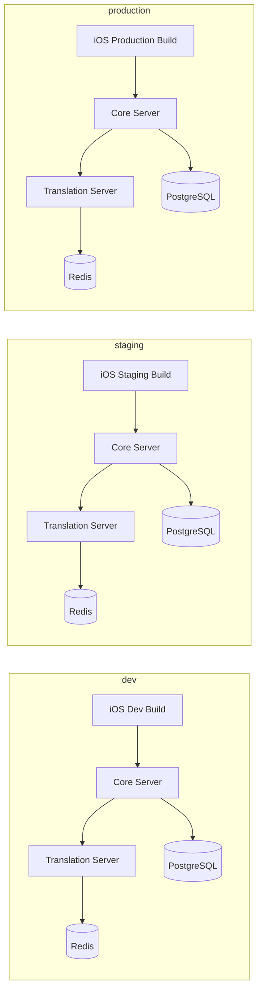

# GamePedia 환경 구조

## 문서 목적

이 문서는 GamePedia의 `dev`, `staging`, `production` 환경 분리 구조와 환경 변수 관리 전략, 보안 전략을 설명한다.

## 환경 분리 구조

| 환경 | 목적 | 설명 |
| --- | --- | --- |
| dev | 개발 및 로컬 검증 | 빠른 기능 확인과 초기 통합 테스트 |
| staging | 릴리스 전 검증 | production과 유사한 환경에서 통합 점검 |
| production | 실제 운영 | 최종 사용자 대상 서비스 제공 |

## 환경 구조 다이어그램



## 프로젝트 구조 설명

```text
GamePedia/
├── apps/ios
├── servers/core
├── servers/translation
└── docs/05-infra
```

| 경로 | 설명 |
| --- | --- |
| `apps/ios` | 환경별 빌드 설정과 API 엔드포인트 분기 |
| `servers/core` | 환경별 Core Server 배포 대상 |
| `servers/translation` | 환경별 Translation Server 배포 대상 |
| `docs/05-infra` | 환경 구조와 보안 정책 문서 |

## 환경 변수 관리 전략

### 서버 환경 변수

서버는 `.env` 파일 또는 배포 환경의 Secret Manager를 통해 설정값을 관리한다.

| 항목 | 예시 |
| --- | --- |
| DB 연결 정보 | `DATABASE_URL` |
| JWT 설정 | `JWT_SECRET`, `JWT_EXPIRES_IN` |
| Redis 설정 | `REDIS_URL` |
| 외부 API 키 | `IGDB_CLIENT_ID`, `IGDB_CLIENT_SECRET`, `PAPAGO_CLIENT_ID`, `PAPAGO_CLIENT_SECRET` |

### iOS 환경 변수

iOS는 `Secrets.xcconfig`와 환경별 `.xcconfig`를 활용해 민감한 설정을 분리한다.

| 파일 | 역할 |
| --- | --- |
| `Secrets.xcconfig` | API Base URL, 비공개 키 참조값 등 민감 설정 |
| `Debug.xcconfig` | dev 환경 설정 |
| `Staging.xcconfig` | staging 환경 설정 |
| `Release.xcconfig` | production 환경 설정 |

## 보안 전략 설명

### 서버 보안 전략

- `.env` 파일은 저장소에 직접 커밋하지 않는다.
- 운영 환경에서는 Secret Manager 또는 배포 플랫폼의 보안 변수를 사용한다.
- JWT Secret은 환경마다 분리한다.
- Papago, IGDB 등 외부 API 키는 환경별로 분리 관리한다.

### iOS 보안 전략

- 민감한 값은 코드에 하드코딩하지 않는다.
- `Secrets.xcconfig`를 통해 빌드 시 주입한다.
- 액세스 토큰과 리프레시 토큰은 Keychain에 저장한다.

### 환경 분리 전략

- `dev`, `staging`, `production`은 서로 다른 DB와 Redis를 사용한다.
- staging은 production과 최대한 유사하게 유지한다.
- production 접근 권한은 최소 인원으로 제한한다.

## 데이터 흐름 관점의 환경 설명

| 환경 | iOS 대상 서버 | 저장소 |
| --- | --- | --- |
| dev | dev Core / dev Translation | dev PostgreSQL / dev Redis |
| staging | staging Core / staging Translation | staging PostgreSQL / staging Redis |
| production | production Core / production Translation | production PostgreSQL / production Redis |

## 레이어 구조 설명

| 레이어 | 역할 |
| --- | --- |
| Client Config Layer | iOS 빌드 설정과 API Base URL 관리 |
| Server Config Layer | Core / Translation 환경 변수 관리 |
| Secret Layer | JWT, DB, Redis, 외부 API 키 보관 |
| Runtime Layer | dev / staging / production 서버 인스턴스 |
| Storage Layer | 환경별 PostgreSQL, Redis 분리 |

## 책임 분리 설명

| 요소 | 책임 |
| --- | --- |
| dev | 빠른 개발과 실험 |
| staging | release 후보 검증 |
| production | 안정적인 사용자 서비스 |
| `.env` | 서버 설정 관리 |
| `Secrets.xcconfig` | iOS 빌드 시 민감 설정 주입 |

## 확장성 고려 사항

- 환경별로 Core와 Translation을 분리 배포하면 부분 롤아웃이 쉬워진다.
- Secret 관리 체계를 정리하면 인프라가 커져도 운영 복잡도를 낮출 수 있다.
- staging의 production 유사도를 높이면 릴리스 실패 확률을 줄일 수 있다.
- 환경별 PostgreSQL/Redis 분리는 장애 전파 범위를 줄이는 기본 조건이다.

## Pencil / Figma / FigJam용 다이어그램 구조

### 프레임 구성

1. dev
2. staging
3. production
4. Secret / Config 관리 영역

### 포함할 박스

- iOS Build
- Core Server
- Translation Server
- PostgreSQL
- Redis
- `.env`
- `Secrets.xcconfig`

### 시각적 강조

- 세 환경의 구조는 동일하게 반복해 비교 가능성을 높인다.
- `Secrets.xcconfig`와 `.env`는 각 환경과 연결하되 별도 보안 영역으로 배치한다.
- production 프레임은 가장 강한 강조 색을 사용한다.
