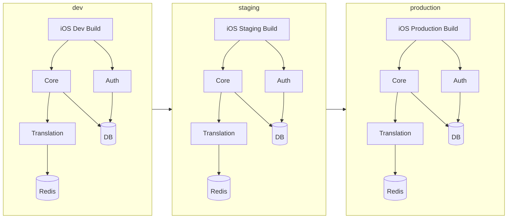
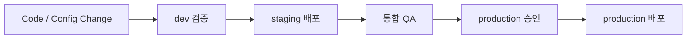

# GamePedia 환경 구조

## 문서 목적

이 문서는 GamePedia의 `dev`, `staging`, `production` 환경 분리 방식과 배포 승격 흐름을 정리한다. 클라이언트와 서버, 데이터 저장소가 환경별로 어떻게 대응되는지 설명한다.

## 프로젝트 개요

GamePedia는 하나의 코드베이스가 아니라 여러 애플리케이션과 서비스가 협력하는 구조이므로, 환경 분리가 배포 안정성에 직접 영향을 준다.

- `dev`: 개발자 검증과 빠른 반복
- `staging`: 릴리스 직전 통합 검증
- `production`: 실제 사용자 서비스

## 기술 스택 정리

| 영역 | 구성 요소 | 목적 |
| --- | --- | --- |
| Client | iOS build configuration | 환경별 API 대상 분리 |
| Server | Core/Auth/Translation instances | 환경별 독립 서비스 |
| Data | Database, Redis | 환경별 데이터 격리 |
| Quality | Winston logs, monitoring hooks | 환경별 품질 확인 |

## 디렉터리 구조 설명

```text
GamePedia/
├── apps/ios
├── servers/core
├── servers/auth
├── servers/translation
└── docs/05-infra
```

문서 관점에서는 각 코드베이스가 환경별 설정을 가진다고 이해하면 된다.

| 경로 | 환경 관점 설명 |
| --- | --- |
| `apps/ios` | dev/staging/prod 빌드 설정 또는 구성 분기 |
| `servers/core` | 환경별 배포 인스턴스 |
| `servers/auth` | 환경별 인증 인스턴스 |
| `servers/translation` | 환경별 번역 및 캐시 인스턴스 |
| `docs/05-infra` | 환경 구조와 승격 정책 문서 |

## 환경 구조 다이어그램



## 환경 승격 흐름



## 환경별 역할 정리

| 환경 | 주요 사용 주체 | 목적 | 주의점 |
| --- | --- | --- | --- |
| dev | 개발자 | 빠른 기능 확인 | 불안정한 기능 허용 가능 |
| staging | QA, 리뷰어, 팀 | 릴리스 전 통합 확인 | production과 최대한 유사해야 함 |
| production | 실제 사용자 | 안정적인 서비스 | 변경 승인과 모니터링 필수 |

## 레이어 구조 설명

| 레이어 | 환경별 의미 |
| --- | --- |
| Client Layer | 각 환경에 대응하는 iOS 빌드 구성 |
| Service Layer | Core/Auth/Translation의 환경별 인스턴스 |
| Data Layer | DB와 Redis의 환경별 분리 |
| Delivery Layer | CI/CD, 승인, 승격 정책 |
| Quality Layer | 로그, 모니터링, 배포 후 검증 |

## 책임 분리 설명

| 요소 | 책임 | 분리 이유 |
| --- | --- | --- |
| dev | 개발 속도와 실험 | 초기 검증 실패를 production과 분리하기 위해 |
| staging | 릴리스 전 재현 환경 | production 유사 검증을 위해 |
| production | 실제 서비스 제공 | 안정성과 변경 통제를 위해 |
| 환경별 DB | 데이터 격리 | 테스트 데이터와 운영 데이터 충돌 방지 |
| 환경별 Redis | 캐시 격리 | 환경 간 오염 방지 |

## 확장성 고려 사항

- 환경별 인프라를 분리하면 장애 전파 범위를 줄일 수 있다.
- staging을 production 유사 구조로 유지하면 배포 실패 확률을 줄일 수 있다.
- 서비스별로 독립 배포가 가능하면 Core/Auth/Translation의 변경을 부분적으로 승격할 수 있다.
- 환경별 로그와 지표를 분리하면 문제 분석 속도가 빨라진다.

## Pencil / Figma / FigJam용 다이어그램 구조

### 배치 방식

- 가로 3열로 `dev`, `staging`, `production`을 나란히 배치한다.
- 각 열 안에는 동일한 구조로 `iOS`, `Auth`, `Core`, `Translation`, `DB`, `Redis`를 반복한다.

### 화살표 규칙

- 각 열 내부는 서비스 통신 관계를 그린다.
- 열과 열 사이에는 승격 흐름만 그린다.
- 직접적인 역방향 화살표는 만들지 않는다.

### 시각적 강조

- production은 가장 진한 테두리로 표시한다.
- staging은 production과 같은 구조를 유지해 유사성을 강조한다.
- dev는 빠른 실험 영역으로 라벨을 명확히 둔다.
