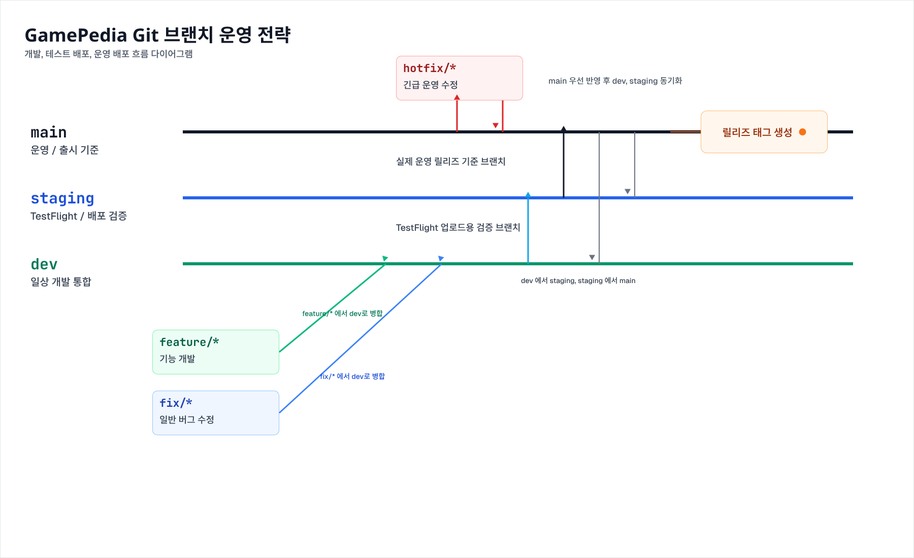

# GamePedia 브랜치 운영 전략

## 개요

이 문서는 GamePedia의 Git 브랜치 운영 기준을 정리한다. 개발 통합, TestFlight 검증, 운영 배포, 긴급 수정 흐름을 일관된 방식으로 관리하는 것을 목표로 한다.

## 브랜치별 역할

| 브랜치 | 역할 | 설명 |
| --- | --- | --- |
| `main` | 운영 / 출시 기준 | 실제 운영 릴리즈 기준 브랜치 |
| `staging` | TestFlight / 배포 검증 | 배포 전 통합 검증과 TestFlight 업로드용 브랜치 |
| `dev` | 개발 통합 | 일반 개발 작업을 통합하는 기본 브랜치 |
| `feature/*` | 기능 개발 | 신규 기능 개발 브랜치 |
| `fix/*` | 일반 버그 수정 | 운영 긴급 건이 아닌 일반 버그 수정 브랜치 |
| `hotfix/*` | 긴급 운영 수정 | 운영 장애 또는 긴급 수정 대응 브랜치 |

## 개발 흐름

기본 개발 흐름은 `feature/*`, `fix/*` 브랜치에서 작업 후 `dev`로 병합하는 방식으로 운영한다.

### 기본 규칙

- 기능 개발은 `feature/*` 브랜치에서 시작한다.
- 일반 버그 수정은 `fix/*` 브랜치에서 시작한다.
- 개발 완료 후 `feature/* -> dev`, `fix/* -> dev` 순서로 병합한다.
- `dev`는 일상 개발 통합 브랜치로 유지한다.

## TestFlight 배포 흐름

배포 전 검증은 `staging` 브랜치를 기준으로 진행한다.

### 기본 규칙

- 검증 대상 코드는 `dev -> staging`으로 병합한다.
- `staging`에서 TestFlight 업로드를 진행한다.
- TestFlight에서 빌드 설치, 주요 기능 점검, 배포 검증을 수행한다.
- 검증 중 발견된 문제는 우선 `dev`에서 수정 후 다시 `staging`으로 반영한다.

## 운영 배포 흐름

운영 배포는 `main` 브랜치를 기준으로 관리한다.

### 기본 규칙

- 배포 검증이 끝난 코드는 `staging -> main`으로 병합한다.
- `main`은 실제 출시 기준 브랜치로 유지한다.
- 운영 배포 시점에 `main`에서 릴리즈 태그를 생성한다.

## hotfix 흐름

긴급 운영 수정은 일반 개발 흐름과 분리해서 처리한다.

### 기본 규칙

- `hotfix/*` 브랜치는 `main`에서 분기한다.
- 긴급 수정은 `main`에 먼저 반영한다.
- 운영 반영 후 동일 변경을 `dev`, `staging`에도 동기화한다.
- hotfix는 운영 장애 대응이나 즉시 수정이 필요한 상황에만 사용한다.

## 운영 원칙 요약

- 일상 개발은 `dev` 중심으로 통합한다.
- 배포 검증은 `staging`에서 TestFlight 기준으로 수행한다.
- 운영 릴리즈 기준은 항상 `main`으로 유지한다.
- 긴급 수정은 `hotfix/*`로 `main`에서 시작해 먼저 반영한다.
- 운영 반영 이후에는 `dev`, `staging`과 반드시 동기화해 브랜치 간 차이를 남기지 않는다.
