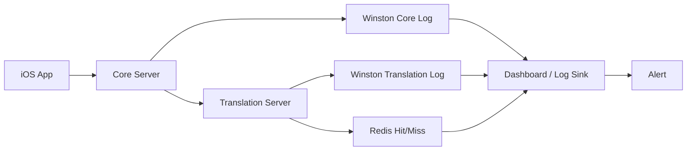

# GamePedia 로깅 및 모니터링

## 문서 목적

이 문서는 GamePedia 서버의 Winston 기반 로그 전략, 로그 레벨 정의, 서버 모니터링 전략, 에러 추적 전략을 정리한다. 최신 구조인 `Core Server + Translation Server` 기준으로 작성한다.

## 로깅 대상 개요

GamePedia는 다음 영역을 중심으로 로그와 모니터링을 설계한다.

| 영역 | 주요 관찰 포인트 |
| --- | --- |
| iOS App | 네트워크 실패, 로그인 실패, 주요 사용자 액션 |
| Core Server | 인증, 게임 조회, 리뷰/찜 처리, DB 오류 |
| Translation Server | 번역 요청 수, Redis hit/miss, Papago 오류 |
| Infrastructure | 환경별 배포 상태, 서버 가용성, 응답 시간 |

## Winston 로그 전략 설명

Winston은 서버 로그를 구조화된 형태로 남기기 위한 기본 로거로 사용한다.

### 기본 원칙

- JSON 기반 구조화 로그를 사용한다.
- 로그에는 `timestamp`, `level`, `message`, `module`, `requestId`를 포함한다.
- Core Server와 Translation Server는 동일한 로그 포맷을 사용한다.
- 민감 정보는 로그에 직접 남기지 않는다.

### 권장 로그 필드

| 필드 | 설명 |
| --- | --- |
| `timestamp` | 로그 발생 시각 |
| `level` | 로그 레벨 |
| `message` | 핵심 메시지 |
| `service` | `core` 또는 `translation` |
| `module` | `auth`, `game`, `review`, `favorite`, `translation` 등 |
| `requestId` | 요청 추적용 식별자 |
| `userId` | 필요 시 사용자 식별자 |
| `metadata` | 추가 문맥 정보 |

## 로그 레벨 정의

| 레벨 | 의미 | 사용 예시 |
| --- | --- | --- |
| `error` | 서비스 실패, 예외, 복구가 필요한 상황 | DB 연결 실패, Papago 호출 실패 |
| `warn` | 즉시 장애는 아니지만 주의가 필요한 상황 | Redis miss 급증, 비정상 토큰 재시도 |
| `info` | 정상적인 주요 이벤트 기록 | 로그인 성공, 리뷰 생성 성공 |
| `debug` | 개발/디버깅용 상세 정보 | 요청 파라미터 흐름, 내부 상태 추적 |

## 로깅 흐름 다이어그램



## Core Server 로깅 전략

| 모듈 | 기록해야 할 항목 |
| --- | --- |
| Auth Module | 로그인 성공/실패, JWT 발급, Refresh Token 재발급, OAuth 오류 |
| Game Module | IGDB 요청 시간, 조회 성공/실패, 번역 요청 여부 |
| Review Module | 리뷰 생성/수정/삭제 결과, 권한 실패 |
| Favorite Module | 찜 추가/삭제/목록 조회 결과 |
| 공통 | 요청 경로, 응답 시간, 상태 코드, 예외 정보 |

## Translation Server 로깅 전략

| 항목 | 기록 내용 |
| --- | --- |
| 번역 요청 수신 | source, target, text length |
| Redis 조회 | cache hit / miss |
| Papago 호출 | 요청 시간, 응답 시간, 실패 여부 |
| 캐시 저장 | 저장 성공/실패, TTL |

## 서버 모니터링 전략 설명

### 핵심 메트릭

| 메트릭 | 설명 |
| --- | --- |
| Request Count | 분당/초당 요청 수 |
| Error Rate | 오류 응답 비율 |
| Response Time | 평균/상위 백분위 응답 시간 |
| Redis Hit Rate | 번역 캐시 적중률 |
| Papago Failure Rate | 외부 번역 API 오류율 |
| DB Query Latency | PostgreSQL 쿼리 지연 시간 |

### 모니터링 대상

- Core Server 헬스 체크
- Translation Server 헬스 체크
- PostgreSQL 연결 상태
- Redis 연결 상태
- IGDB / Papago 외부 의존성 상태

## 에러 추적 전략 설명

### 원칙

- 모든 요청에 `requestId`를 부여해 Core와 Translation 간 추적이 가능해야 한다.
- `error` 로그에는 예외 메시지, 스택, 모듈명, 요청 경로를 포함한다.
- 사용자 입력 오류와 서버 내부 오류를 구분해 기록한다.

### 추적 포인트

| 구간 | 추적 내용 |
| --- | --- |
| iOS -> Core | 요청 시작, 인증 상태, 응답 결과 |
| Core Auth Module | JWT 발급/검증 실패, OAuth 예외 |
| Core -> IGDB | 외부 게임 정보 조회 실패 |
| Core -> Translation | 번역 요청 및 응답 지연 |
| Translation -> Papago | 외부 번역 API 실패 |
| Translation -> Redis | 캐시 연결 오류, 저장 실패 |

## 디렉터리 구조 설명

```text
GamePedia/
├── servers/core
├── servers/translation
└── docs/06-quality
```

| 경로 | 설명 |
| --- | --- |
| `servers/core` | Core Server 로그와 모니터링 기준 적용 대상 |
| `servers/translation` | Translation Server 로그와 캐시 메트릭 대상 |
| `docs/06-quality` | 품질 기준과 운영 규칙 문서 |

## 책임 분리 설명

| 구성 요소 | 책임 |
| --- | --- |
| Core Server | 메인 API 로그, 인증/도메인 처리 로그 |
| Translation Server | 번역/캐시 처리 로그 |
| Dashboard / Alert | 로그 집계, 시각화, 이상 감지 |
| iOS App | 사용자 관점 오류와 네트워크 실패 수집 |

## 확장성 고려 사항

- 로그 포맷을 공통화하면 서버 인스턴스가 늘어나도 검색과 집계가 쉽다.
- `requestId` 전파를 표준화하면 Core와 Translation 사이의 추적이 쉬워진다.
- Redis hit rate를 지표화하면 번역 비용 최적화 의사결정에 도움이 된다.
- `debug` 로그는 환경별로 다르게 제어해 production 로그 노이즈를 줄일 수 있다.

## Pencil / Figma / FigJam용 다이어그램 구조

### 보드 구성

1. iOS App 로그
2. Core Server 로그
3. Translation Server 로그
4. Redis / Papago 메트릭
5. Dashboard / Alert

### 포함할 박스

- `Winston Logger`
- `Auth Module Logs`
- `Game Module Logs`
- `Review Module Logs`
- `Favorite Module Logs`
- `Translation Logs`
- `Redis Hit/Miss`
- `Dashboard`
- `Alert`

### 시각적 강조

- Core와 Translation 로그는 별도 색으로 구분한다.
- `error / warn / info / debug` 레벨은 범례로 함께 배치한다.
- Redis hit/miss는 일반 로그가 아니라 메트릭 카드로 분리한다.
