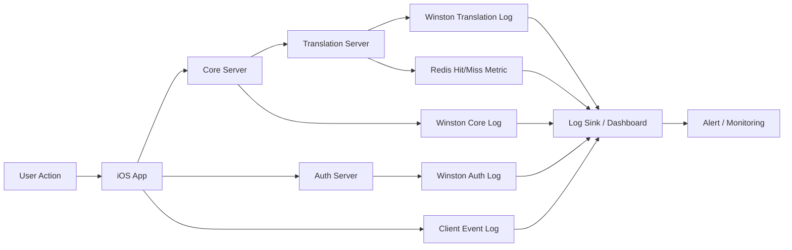

# GamePedia 로깅 및 모니터링

## 문서 목적

이 문서는 GamePedia의 품질 관점에서 로그 수집, 장애 추적, 캐시 관찰, 인증 이벤트 확인, 배포 후 검증 포인트를 정리한다. 구현체를 고정하기보다 어떤 신호를 반드시 남겨야 하는지에 집중한다.

## 프로젝트 개요

GamePedia는 iOS 앱과 3개의 서버로 구성되므로, 문제를 빠르게 추적하려면 서비스별 로그와 공통 추적 키가 필요하다.

- iOS는 사용자 액션, 네트워크 실패, 화면 전환 오류를 남긴다.
- Auth는 로그인/토큰 관련 이벤트를 남긴다.
- Core는 도메인 API 성능과 실패를 남긴다.
- Translation은 번역 요청과 Redis hit/miss를 남긴다.

## 기술 스택 정리

| 영역 | 기술 / 방식 | 목적 |
| --- | --- | --- |
| Server Logging | Winston logger | 구조화 로그 출력 |
| Client Logging | 앱 내부 이벤트 로깅 | 사용자 플로우 오류 추적 |
| Metrics | request count, latency, error rate, cache hit rate | 운영 상태 가시화 |
| Monitoring | Dashboard / Alert Sink | 이상 징후 탐지 |

## 디렉터리 구조 설명

```text
GamePedia/
├── apps/ios
├── servers/core
├── servers/auth
├── servers/translation
└── docs/06-quality
```

| 경로 | 품질 관점 설명 |
| --- | --- |
| `apps/ios` | 사용자 이벤트, 네트워크 오류, 화면 상태 로그 출발점 |
| `servers/core` | API 성공/실패, DB 성능, 도메인 오류 추적 |
| `servers/auth` | 로그인 성공/실패, 토큰 발급/갱신 추적 |
| `servers/translation` | 번역 처리 시간, Redis hit/miss, Papago 오류 추적 |
| `docs/06-quality` | 품질 기준과 운영 시그널 문서화 |

## 로깅/모니터링 데이터 흐름 다이어그램



## 핵심 관찰 포인트

| 영역 | 반드시 기록할 항목 |
| --- | --- |
| iOS | 화면 진입, 주요 사용자 액션, API 실패, 토큰 만료 처리 |
| Auth | 로그인 성공/실패, OAuth provider 응답, 토큰 발급/갱신 실패 |
| Core | 요청 경로, 응답 시간, DB 오류, 외부 API 실패 |
| Translation | 요청 텍스트 길이, 응답 시간, Papago 오류, Redis hit/miss |
| Infra | 환경, 배포 버전, 인스턴스 식별자 |

## 레이어 구조 설명

| 레이어 | 책임 |
| --- | --- |
| Client Signal Layer | 앱 이벤트와 사용자 오류 흐름 기록 |
| API Log Layer | 서버 요청/응답과 예외 기록 |
| Domain Metric Layer | 로그인 성공률, 리뷰 생성 실패율, 번역 지연 등 서비스 지표 |
| Cache / Integration Layer | Redis hit rate, Papago/IGDB/OAuth 오류율 |
| Alert Layer | 임계치 초과 시 운영자 알림 |

## 책임 분리 설명

| 주체 | 책임 |
| --- | --- |
| iOS Client | 사용자 플로우 단위 이벤트와 네트워크 실패 기록 |
| Auth Server | 인증 관련 보안 이벤트 기록 |
| Core Server | 비즈니스 API 성능과 예외 기록 |
| Translation Server | 캐시 전략 결과와 번역 실패 기록 |
| Monitoring Layer | 로그 집계, 시각화, 알림 발송 |

로그 책임 분리 원칙은 다음과 같다.

- 인증 실패와 도메인 실패를 같은 로그 스트림으로 섞지 않는다.
- Translation의 cache hit/miss는 별도 지표로 다룬다.
- iOS 이벤트 로그는 서버 로그와 상호 연관 가능한 request id 또는 trace id를 가지는 것이 이상적이다.

## 확장성 고려 사항

- 구조화 로그를 유지하면 다중 인스턴스 환경에서도 검색과 집계가 가능하다.
- 서비스별 대시보드를 분리하면 장애 원인을 빠르게 좁힐 수 있다.
- Redis hit rate와 Papago latency를 따로 보면 번역 비용 최적화 지점을 찾기 쉽다.
- 배포 버전 정보를 로그에 포함하면 staging과 production 이슈 비교가 쉬워진다.

## Pencil / Figma / FigJam용 다이어그램 구조

### 보드 존

1. Client Signal
2. Auth Logging
3. Core Logging
4. Translation Logging
5. Metrics / Dashboard / Alert

### 박스 구성

- 서비스 박스 옆에 작은 로그 박스를 붙인다.
- Redis hit/miss는 Translation 옆 별도 메트릭 카드로 둔다.
- 마지막에는 Dashboard와 Alert를 공통 종착지로 둔다.

### 화살표 규칙

- 서비스 -> 로그 박스
- 로그 박스 -> Dashboard
- Dashboard -> Alert

### 시각적 강조

- Auth는 보안 이벤트
- Core는 API 성능
- Translation은 캐시 성능
- Client는 사용자 체감 이슈 추적이라는 목적을 명확히 라벨링한다
